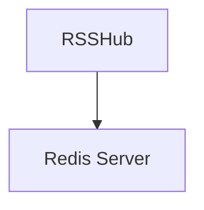
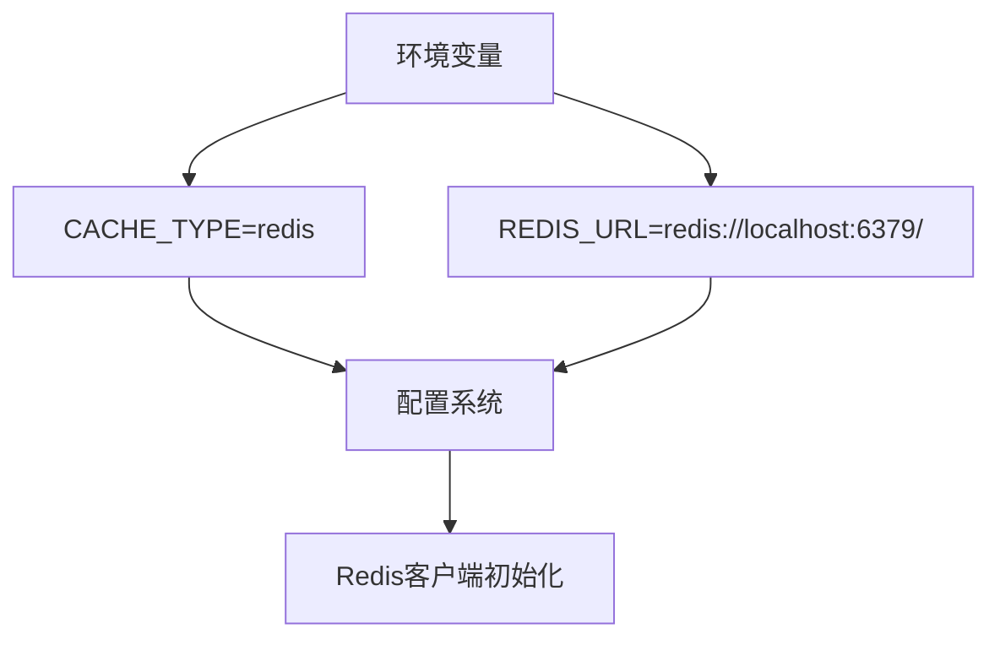
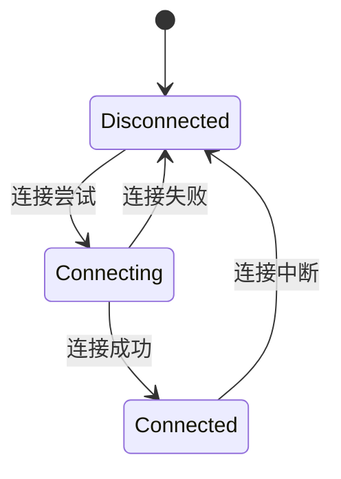

# Redis连接配置

<cite>
**本文档引用的文件**
- [config.ts](file://lib/config.ts)
- [redis.ts](file://lib/utils/cache/redis.ts)
- [index.ts](file://lib/utils/cache/index.ts)
- [rsshub.env](file://scripts/ansible/rsshub.env)
- [docker-compose.yml](file://docker-compose.yml)
- [flake.nix](file://flake.nix)
</cite>

## 目录
1. [简介](#简介)
2. [Redis连接参数配置](#redis连接参数配置)
3. [连接模式配置](#连接模式配置)
4. [环境变量与配置文件设置](#环境变量与配置文件设置)
5. [网络相关配置](#网络相关配置)
6. [代码实现示例](#代码实现示例)
7. [常见连接问题诊断](#常见连接问题诊断)

## 简介

RSSHub 是一个开源的 RSS 生成器，支持通过 Redis 作为缓存后端来提升性能和可靠性。本文档详细说明了如何配置 Redis 连接，包括基本连接参数、连接字符串格式、不同连接模式的配置差异、环境变量和配置文件的设置方法，以及网络相关配置选项。同时提供了实际代码示例和常见连接问题的诊断解决方案。

## Redis连接参数配置

### 基本连接参数

在 RSSHub 中，Redis 连接的基本参数通过环境变量进行配置。主要参数包括：

- **主机地址**：通过 `REDIS_URL` 环境变量指定 Redis 服务器的地址
- **端口号**：包含在 `REDIS_URL` 的连接字符串中
- **认证密码**：在 `REDIS_URL` 中以用户密码形式包含
- **数据库索引**：在 `REDIS_URL` 中以路径形式指定

这些参数在 `lib/config.ts` 文件中被定义和处理，其中 `REDIS_URL` 的默认值为 `redis://localhost:6379/`。

### 连接字符串格式

Redis 连接字符串遵循标准的 URL 格式：
```
redis://[:password@]host[:port][/db-number]
```

例如：
- 无密码连接：`redis://localhost:6379/`
- 带密码连接：`redis://:mypassword@localhost:6379/`
- 指定数据库：`redis://localhost:6379/1`

**Section sources**
- [config.ts](file://lib/config.ts#L745-L747)

## 连接模式配置

### 单机模式

单机模式是最简单的 Redis 部署方式，适用于大多数应用场景。在 RSSHub 中，通过设置 `CACHE_TYPE=redis` 和 `REDIS_URL` 环境变量即可启用单机模式。



**Diagram sources**
- [config.ts](file://lib/config.ts#L735-L737)
- [redis.ts](file://lib/utils/cache/redis.ts#L22)

### 集群模式

RSSHub 目前主要支持单机 Redis 部署，对于集群模式的支持需要通过外部配置实现。在生产环境中，可以通过外部 Redis 集群服务并配置相应的连接 URL 来实现高可用性。

### 哨兵模式

哨兵模式的配置与集群模式类似，需要通过外部 Redis 哨兵系统进行管理。RSSHub 本身不直接处理哨兵模式的连接逻辑，而是依赖于 Redis 客户端库的内置支持。

**Section sources**
- [config.ts](file://lib/config.ts#L735-L747)
- [redis.ts](file://lib/utils/cache/redis.ts#L22)

## 环境变量与配置文件设置

### 环境变量配置

RSSHub 支持通过环境变量进行 Redis 配置，主要环境变量包括：

- `CACHE_TYPE`: 缓存类型，设置为 `redis` 以启用 Redis 缓存
- `REDIS_URL`: Redis 连接 URL



**Diagram sources**
- [config.ts](file://lib/config.ts#L735-L747)
- [index.ts](file://lib/utils/cache/index.ts#L18-L20)

### 配置文件设置

#### Docker Compose 配置

在 `docker-compose.yml` 文件中，可以通过服务环境变量配置 Redis 连接：

```yaml
services:
  rsshub:
    environment:
      - CACHE_TYPE=redis
      - REDIS_URL=redis://redis:6379/
```

#### Nix 配置

在 `flake.nix` 文件中，提供了 Redis 配置的声明式定义：

```nix
redis = {
  enable = mkOption {
    type = types.bool;
    default = false;
    description = "Whether to enable and configure Redis for caching.";
  };
  url = mkOption {
    type = types.str;
    default = "redis://localhost:6379/";
    description = "Redis connection URL.";
  };
};
```

**Section sources**
- [docker-compose.yml](file://docker-compose.yml#L11-L13)
- [flake.nix](file://flake.nix#L169-L187)
- [rsshub.env](file://scripts/ansible/rsshub.env#L1-L2)

## 网络相关配置

### 连接超时

RSSHub 的 Redis 连接超时由 Redis 客户端库默认处理。在 `lib/utils/cache/redis.ts` 中，通过监听 Redis 客户端的错误事件来处理连接问题：

```typescript
clients.redisClient.on('error', (error) => {
    status.available = false;
    logger.error('Redis error: ', error);
});
```

### 重试机制

RSSHub 本身不直接实现 Redis 连接重试机制，而是依赖于 ioredis 客户端库的内置重连功能。当连接断开时，客户端会自动尝试重新连接。



**Diagram sources**
- [redis.ts](file://lib/utils/cache/redis.ts#L24-L34)

## 代码实现示例

### Redis 客户端初始化

在 `lib/utils/cache/redis.ts` 中，Redis 客户端的初始化过程如下：

```typescript
export default {
    init: () => {
        clients.redisClient = new Redis(config.redis.url);
        clients.redisClient.on('error', (error) => {
            status.available = false;
            logger.error('Redis error: ', error);
        });
        clients.redisClient.on('connect', () => {
            status.available = true;
            logger.info('Redis connected.');
        });
    },
    // ... 其他方法
}
```

### 缓存模块集成

在 `lib/utils/cache/index.ts` 中，根据配置选择适当的缓存类型：

```typescript
if (config.cache.type === 'redis') {
    cacheModule = redis;
    cacheModule.init();
} else if (config.cache.type === 'memory') {
    cacheModule = memory;
    cacheModule.init();
}
```

**Section sources**
- [redis.ts](file://lib/utils/cache/redis.ts#L21-L35)
- [index.ts](file://lib/utils/cache/index.ts#L18-L31)

## 常见连接问题诊断

### 连接失败诊断

当 Redis 连接失败时，可以检查以下方面：

1. **环境变量配置**：确认 `CACHE_TYPE` 和 `REDIS_URL` 环境变量已正确设置
2. **网络连通性**：确保 RSSHub 实例能够访问 Redis 服务器
3. **认证信息**：检查密码和用户名是否正确
4. **端口开放**：确认 Redis 端口（默认 6379）已开放

### 错误日志分析

RSSHub 会在连接出现问题时记录相关日志：

```typescript
clients.redisClient.on('error', (error) => {
    status.available = false;
    logger.error('Redis error: ', error);
});
```

常见的错误包括：
- 连接拒绝：检查 Redis 服务是否运行
- 认证失败：验证密码是否正确
- 网络超时：检查网络连通性和防火墙设置

### 测试连接

可以通过以下步骤测试 Redis 连接：

1. 确认环境变量已正确设置
2. 检查 Redis 服务状态
3. 使用 `redis-cli` 工具测试连接
4. 查看 RSSHub 日志中的连接信息

**Section sources**
- [redis.ts](file://lib/utils/cache/redis.ts#L24-L34)
- [index.ts](file://lib/utils/cache/index.ts#L18-L20)