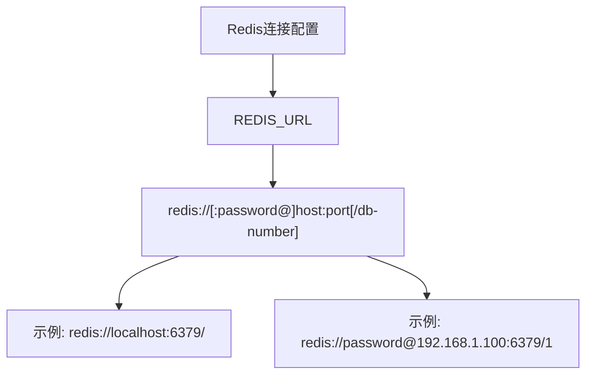
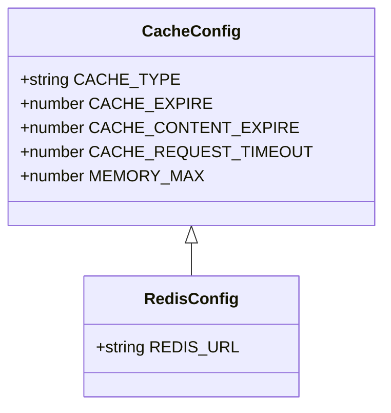
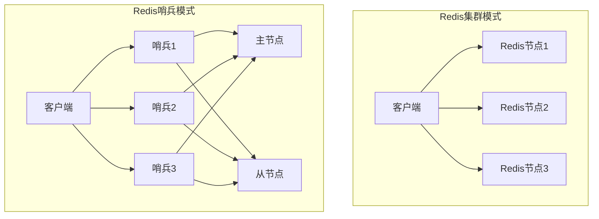
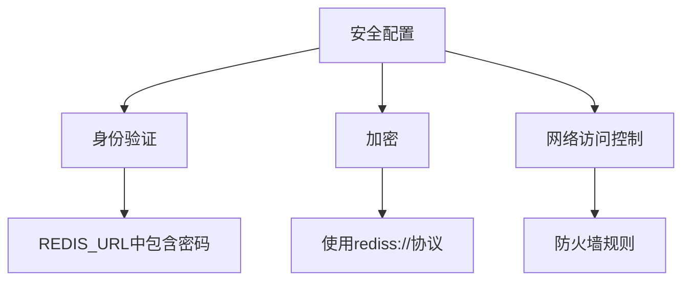
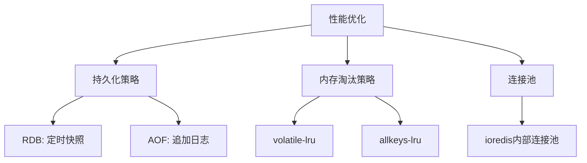
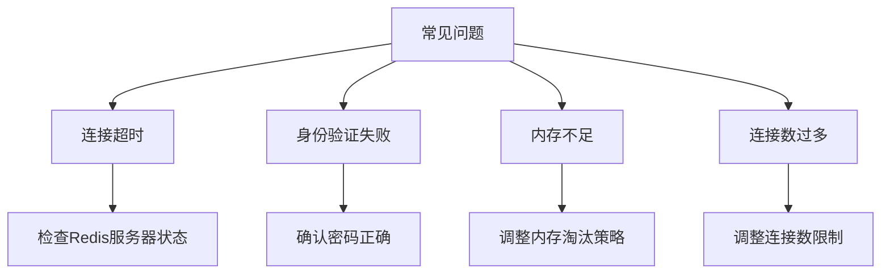

# Redis配置

<cite>
**本文档中引用的文件**  
- [config.ts](file://lib/config.ts)
- [redis.ts](file://lib/utils/cache/redis.ts)
- [index.ts](file://lib/utils/cache/index.ts)
- [base.ts](file://lib/utils/cache/base.ts)
- [docker-compose.yml](file://docker-compose.yml)
- [flake.nix](file://flake.nix)
- [rsshub.env](file://scripts/ansible/rsshub.env)
</cite>

## 目录
1. [简介](#简介)
2. [Redis连接配置](#redis连接配置)
3. [缓存类型与配置](#缓存类型与配置)
4. [Redis集群与哨兵模式](#redis集群与哨兵模式)
5. [安全配置](#安全配置)
6. [性能优化配置](#性能优化配置)
7. [实际配置示例](#实际配置示例)
8. [常见连接问题解决方案](#常见连接问题解决方案)
9. [总结](#总结)

## 简介

RSSHub 是一个开源的 RSS 生成器，支持将各种网站内容转换为 RSS 订阅源。为了提高性能和响应速度，RSSHub 支持使用 Redis 作为缓存后端。本文档详细介绍了 RSSHub 中 Redis 缓存的配置方法，包括连接配置、连接池、超时设置、安全配置、性能优化以及常见问题的解决方案。

**Section sources**
- [config.ts](file://lib/config.ts#L1-L1188)

## Redis连接配置

RSSHub 使用环境变量来配置 Redis 连接。主要的配置项是 `REDIS_URL`，它定义了 Redis 服务器的连接字符串。连接字符串的格式遵循标准的 Redis URL 格式：`redis://[:password@]host:port[/db-number]`。

在 RSSHub 中，`REDIS_URL` 的默认值为 `redis://localhost:6379/`，这意味着如果未指定其他值，RSSHub 将尝试连接到本地运行的 Redis 服务器，端口为 6379，数据库编号为 0。



**Diagram sources**
- [config.ts](file://lib/config.ts#L745-L747)

**Section sources**
- [config.ts](file://lib/config.ts#L27-L28)
- [config.ts](file://lib/config.ts#L745-L747)

## 缓存类型与配置

RSSHub 支持多种缓存类型，包括内存缓存和 Redis 缓存。缓存类型由 `CACHE_TYPE` 环境变量控制。当 `CACHE_TYPE` 设置为 `redis` 时，RSSHub 将使用 Redis 作为缓存后端；当设置为 `memory` 时，将使用内存缓存；如果设置为空或未设置，则禁用缓存。

除了缓存类型，RSSHub 还提供了多个与缓存相关的配置选项：

- `CACHE_EXPIRE`: 路由缓存时间，单位为秒，默认值为 300 秒（5 分钟）。
- `CACHE_CONTENT_EXPIRE`: 不变内容缓存时间，单位为秒，默认值为 3600 秒（1 小时）。
- `CACHE_REQUEST_TIMEOUT`: 缓存请求超时时间，单位为秒，默认值为 60 秒。
- `MEMORY_MAX`: 内存缓存的最大项目数，默认值为 256。



**Diagram sources**
- [config.ts](file://lib/config.ts#L735-L747)

**Section sources**
- [config.ts](file://lib/config.ts#L23-L27)
- [config.ts](file://lib/config.ts#L735-L747)

## Redis集群与哨兵模式

根据当前的代码库分析，RSSHub 目前主要支持单个 Redis 实例的连接，通过 `REDIS_URL` 环境变量进行配置。代码中使用了 `ioredis` 库来管理 Redis 连接，该库本身支持 Redis 集群和哨兵模式，但 RSSHub 的配置接口并未直接暴露这些高级功能的配置选项。

要使用 Redis 集群或哨兵模式，可能需要通过 `REDIS_URL` 的特殊格式或在代码层面进行扩展。例如，对于 Redis 集群，`REDIS_URL` 可以是一个包含多个节点地址的 URL；对于哨兵模式，可能需要在代码中手动配置哨兵节点。



**Diagram sources**
- [redis.ts](file://lib/utils/cache/redis.ts#L1-L78)

**Section sources**
- [redis.ts](file://lib/utils/cache/redis.ts#L1-L78)

## 安全配置

RSSHub 的 Redis 安全配置主要依赖于 Redis 服务器本身的配置。通过 `REDIS_URL` 中的密码部分，可以实现基本的身份验证。例如，`redis://password@localhost:6379/` 表示连接到 Redis 服务器时需要提供密码。

此外，建议在生产环境中采取以下安全措施：

- 使用 TLS/SSL 加密 Redis 连接，可以通过 `rediss://` 协议前缀实现。
- 限制 Redis 服务器的网络访问，仅允许来自 RSSHub 服务器的连接。
- 定期更新 Redis 服务器的密码，并确保密码的复杂性。



**Diagram sources**
- [config.ts](file://lib/config.ts#L745-L747)

**Section sources**
- [config.ts](file://lib/config.ts#L745-L747)

## 性能优化配置

为了优化 Redis 缓存的性能，RSSHub 提供了多个配置选项。这些选项可以帮助调整缓存的行为，以适应不同的使用场景。

- **持久化策略**: Redis 支持 RDB 和 AOF 两种持久化方式。RDB 是定时快照，AOF 是追加日志。根据数据的重要性和性能要求选择合适的持久化策略。
- **内存淘汰策略**: Redis 提供了多种内存淘汰策略，如 `volatile-lru`、`allkeys-lru` 等。选择合适的策略可以避免内存溢出。
- **连接池配置**: 虽然 RSSHub 本身没有显式的连接池配置，但 `ioredis` 库内部实现了连接池，可以有效管理多个连接。



**Diagram sources**
- [redis.ts](file://lib/utils/cache/redis.ts#L21-L35)

**Section sources**
- [redis.ts](file://lib/utils/cache/redis.ts#L21-L35)

## 实际配置示例

以下是一些实际的 Redis 配置示例，展示了如何在不同的部署环境中配置 RSSHub 的 Redis 缓存。

### Docker Compose 配置

在 `docker-compose.yml` 文件中，可以定义 RSSHub 和 Redis 服务，并通过环境变量配置 Redis 连接。

```yaml
version: '3'
services:
  rsshub:
    image: diygod/rsshub
    restart: always
    ports:
      - '1200:1200'
    environment:
      NODE_ENV: production
      CACHE_TYPE: redis
      REDIS_URL: 'redis://redis:6379/'
    depends_on:
      - redis

  redis:
    image: redis:alpine
    restart: always
    volumes:
      - redis-data:/data

volumes:
  redis-data:
```

**Section sources**
- [docker-compose.yml](file://docker-compose.yml#L1-L63)

### Nix Flake 配置

在 `flake.nix` 文件中，可以使用 Nix 配置语言来定义 RSSHub 的 Redis 配置。

```nix
{
  description = "RSSHub with Redis";

  inputs = {
    nixpkgs.url = "github:NixOS/nixpkgs/nixos-unstable";
    devenv.url = "github:cachix/devenv";
  };

  outputs = { self, nixpkgs, devenv }:
    let
      system = "x86_64-linux";
      pkgs = nixpkgs.legacyPackages.${system};
    in
    {
      devShells.${system}.default = devenv.lib.mkShell {
        imports = [ ./devenv.nix ];
        env = {
          CACHE_TYPE = "redis";
          REDIS_URL = "redis://localhost:6379/";
        };
      };
    };
}
```

**Section sources**
- [flake.nix](file://flake.nix#L152-L188)

## 常见连接问题解决方案

在使用 Redis 缓存时，可能会遇到一些常见的连接问题。以下是一些解决方案：

- **连接超时**: 检查 Redis 服务器是否正在运行，并确保网络连接正常。可以通过 `ping` 命令测试连接。
- **身份验证失败**: 确认 `REDIS_URL` 中的密码是否正确，并检查 Redis 服务器的配置。
- **内存不足**: 检查 Redis 服务器的内存使用情况，并调整内存淘汰策略。
- **连接数过多**: 检查 RSSHub 和 Redis 服务器的连接数限制，并适当调整。



**Diagram sources**
- [redis.ts](file://lib/utils/cache/redis.ts#L24-L34)

**Section sources**
- [redis.ts](file://lib/utils/cache/redis.ts#L24-L34)

## 总结

本文档详细介绍了 RSSHub 中 Redis 缓存的配置方法，涵盖了连接配置、缓存类型、安全配置、性能优化以及常见问题的解决方案。通过合理配置 Redis，可以显著提升 RSSHub 的性能和稳定性。建议在生产环境中使用 Redis 作为缓存后端，并根据实际需求调整相关配置。

**Section sources**
- [config.ts](file://lib/config.ts#L1-L1188)
- [redis.ts](file://lib/utils/cache/redis.ts#L1-L78)
- [docker-compose.yml](file://docker-compose.yml#L1-L63)
- [flake.nix](file://flake.nix#L152-L188)