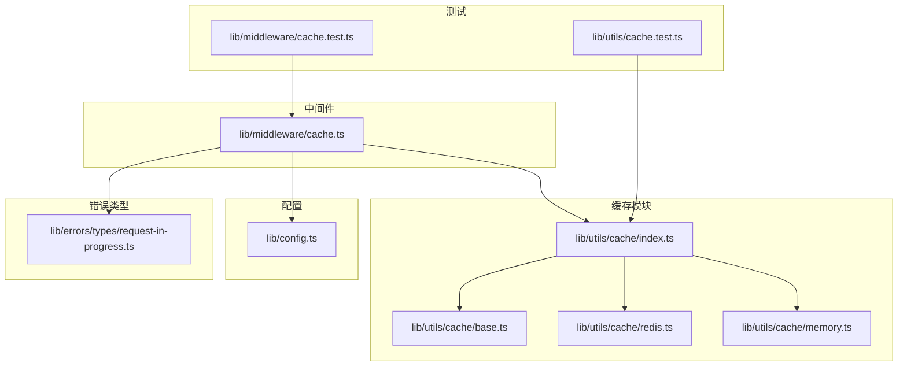
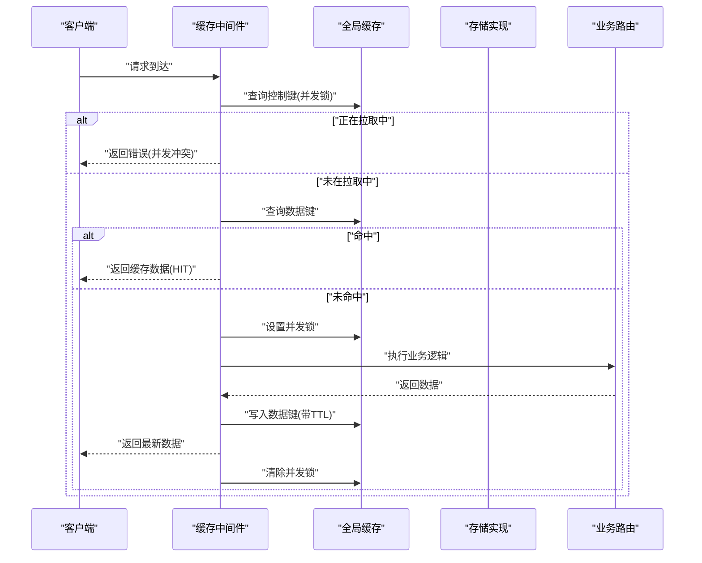
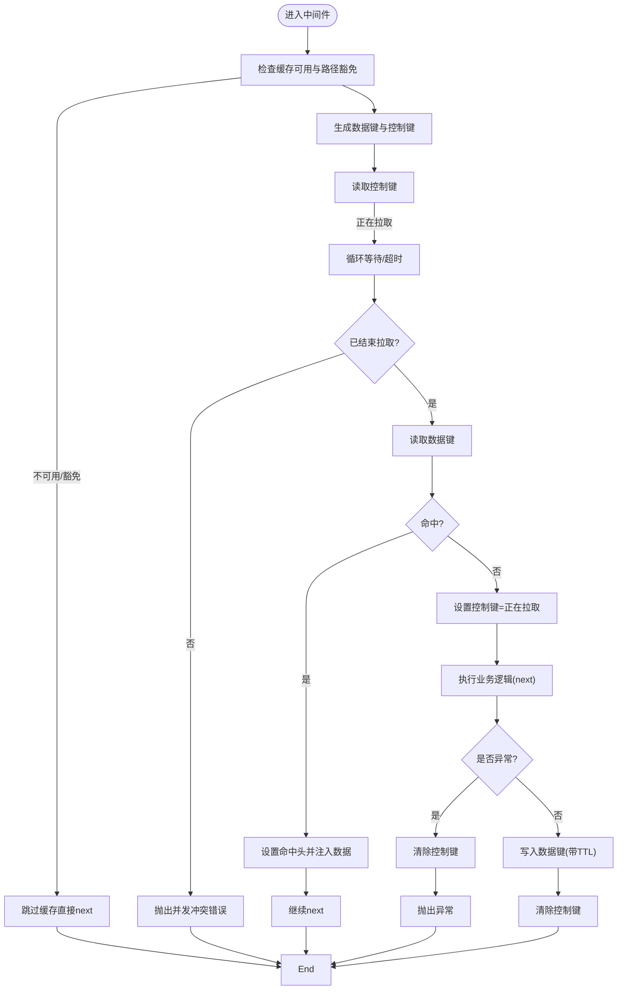
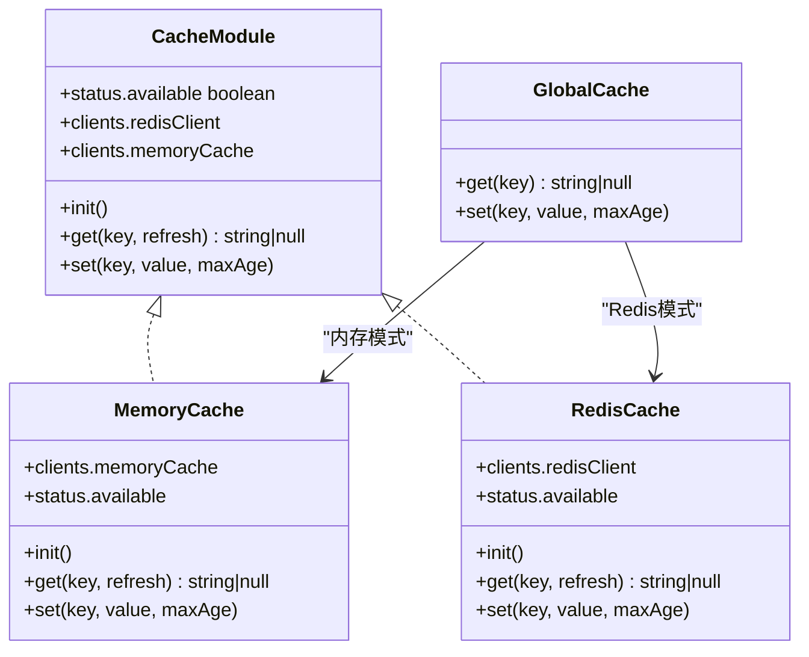
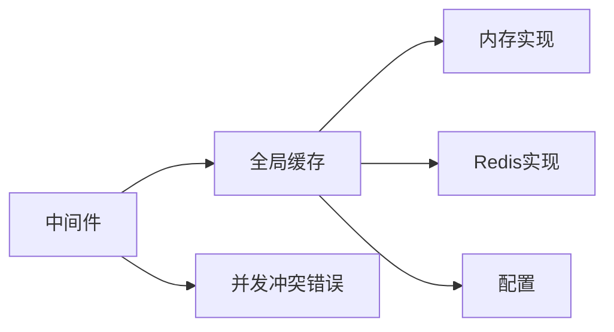

# 缓存策略

<cite>
**本文引用的文件**
- [lib/middleware/cache.ts](file://lib/middleware/cache.ts)
- [lib/config.ts](file://lib/config.ts)
- [lib/utils/cache/index.ts](file://lib/utils/cache/index.ts)
- [lib/utils/cache/memory.ts](file://lib/utils/cache/memory.ts)
- [lib/utils/cache/redis.ts](file://lib/utils/cache/redis.ts)
- [lib/utils/cache/base.ts](file://lib/utils/cache/base.ts)
- [lib/errors/types/request-in-progress.ts](file://lib/errors/types/request-in-progress.ts)
- [lib/middleware/cache.test.ts](file://lib/middleware/cache.test.ts)
- [lib/utils/cache.test.ts](file://lib/utils/cache.test.ts)
- [lib/routes/telegram/channel-media.ts](file://lib/routes/telegram/channel-media.ts)
- [lib/routes/test/cache.ts](file://lib/routes/test/cache.ts)
</cite>

## 目录
1. [简介](#简介)
2. [项目结构与定位](#项目结构与定位)
3. [核心组件](#核心组件)
4. [架构总览](#架构总览)
5. [详细组件分析](#详细组件分析)
6. [依赖关系分析](#依赖关系分析)
7. [性能与容量特性](#性能与容量特性)
8. [常见问题与防护策略](#常见问题与防护策略)
9. [故障排查指南](#故障排查指南)
10. [结论](#结论)
11. [附录：配置项速查](#附录配置项速查)

## 简介
本文件系统性梳理 RSSHub 的缓存策略设计与实现，覆盖缓存键生成、过期时间、并发控制、LRU 淘汰、一致性与一致性保障、以及针对缓存穿透、缓存雪崩、缓存预热等场景的防护建议。文档同时给出可操作的配置说明与最佳实践，帮助在不同部署规模下获得稳定、高性能的缓存体验。

## 项目结构与定位
- 中间件层负责对请求进行缓存命中判断、并发控制与缓存写入；对外暴露统一的全局缓存接口。
- 配置层集中管理缓存类型、过期时间、内存容量、Redis 连接等参数。
- 缓存模块层提供内存与 Redis 两种实现，并通过统一接口适配上层调用。
- 错误类型用于在并发冲突时向客户端返回明确的错误信息。

图表来源
- [lib/middleware/cache.ts](file://lib/middleware/cache.ts#L1-L83)
- [lib/config.ts](file://lib/config.ts#L735-L768)
- [lib/utils/cache/index.ts](file://lib/utils/cache/index.ts#L1-L100)
- [lib/utils/cache/memory.ts](file://lib/utils/cache/memory.ts#L1-L45)
- [lib/utils/cache/redis.ts](file://lib/utils/cache/redis.ts#L1-L78)
- [lib/utils/cache/base.ts](file://lib/utils/cache/base.ts#L1-L17)
- [lib/errors/types/request-in-progress.ts](file://lib/errors/types/request-in-progress.ts#L1-L6)
- [lib/middleware/cache.test.ts](file://lib/middleware/cache.test.ts#L1-L190)
- [lib/utils/cache.test.ts](file://lib/utils/cache.test.ts#L1-L92)

章节来源
- [lib/middleware/cache.ts](file://lib/middleware/cache.ts#L1-L83)
- [lib/config.ts](file://lib/config.ts#L735-L768)
- [lib/utils/cache/index.ts](file://lib/utils/cache/index.ts#L1-L100)

## 核心组件
- 缓存中间件：负责生成缓存键、并发控制、命中/未命中分支、缓存写入与状态头设置。
- 全局缓存模块：根据配置选择内存或 Redis 实现，提供 get/set 接口，并导出 tryGet 辅助方法。
- 内存缓存（LRU）：基于 lru-cache，支持最大条目数与 TTL。
- Redis 缓存：基于 ioredis，支持 TTL 精细化控制与过期刷新。
- 配置：集中定义缓存类型、过期时间、内存容量、Redis 地址等。

章节来源
- [lib/middleware/cache.ts](file://lib/middleware/cache.ts#L1-L83)
- [lib/utils/cache/index.ts](file://lib/utils/cache/index.ts#L1-L100)
- [lib/utils/cache/memory.ts](file://lib/utils/cache/memory.ts#L1-L45)
- [lib/utils/cache/redis.ts](file://lib/utils/cache/redis.ts#L1-L78)
- [lib/config.ts](file://lib/config.ts#L735-L768)

## 架构总览
RSSHub 的缓存采用“中间件 + 模块化存储”的分层设计：
- 中间件层在路由前拦截请求，计算缓存键，检查并发锁，命中则直接返回，未命中则执行业务逻辑并将结果写回缓存。
- 存储层通过统一接口适配内存与 Redis，支持 TTL 与 LRU 淘汰。
- 配置层决定缓存类型与过期策略，测试用例验证 TTL 与命中行为。

图表来源
- [lib/middleware/cache.ts](file://lib/middleware/cache.ts#L1-L83)
- [lib/utils/cache/index.ts](file://lib/utils/cache/index.ts#L1-L100)
- [lib/utils/cache/memory.ts](file://lib/utils/cache/memory.ts#L1-L45)
- [lib/utils/cache/redis.ts](file://lib/utils/cache/redis.ts#L1-L78)

## 详细组件分析

### 缓存中间件（请求级并发与命中）
- 缓存键生成策略
  - 使用 xxhash 对路径、format、limit 组合进行哈希，形成短键，避免冗长键导致的存储压力。
  - 同时维护一个“控制键”，用于标记当前路径是否正在被拉取。
- 并发控制
  - 若控制键为“正在拉取”，中间件会轮询等待，超过重试次数则抛出并发冲突错误。
  - 业务执行异常时会释放控制键，避免死锁。
- 命中与写入
  - 命中时设置响应头以标识命中状态，并将数据注入上下文。
  - 未命中时在 next 执行后，若响应未显式禁用缓存，则将数据写回缓存并更新控制键。
- 特殊路径豁免
  - 对根路径与静态资源路径直接放行，不参与缓存。

图表来源
- [lib/middleware/cache.ts](file://lib/middleware/cache.ts#L1-L83)

章节来源
- [lib/middleware/cache.ts](file://lib/middleware/cache.ts#L1-L83)

### 全局缓存模块与存储实现
- 统一接口
  - 提供 get/set 与 tryGet 辅助方法，tryGet 在未命中时自动调用回调函数获取数据并写入缓存。
- 内存实现（LRU）
  - 使用 lru-cache，支持 max 条目数与 ttl。
  - get 支持按需刷新 TTL。
- Redis 实现
  - 使用 ioredis，支持 TTL 精细化控制。
  - 为每个键额外维护一个“TTL键”，用于记录该键的自定义过期时间；若未设置则默认使用“内容过期”。
  - get 时会根据 TTL 键刷新主键与 TTL 键的过期时间。
- 全局缓存桥接
  - 根据配置选择具体实现，提供统一的 globalCache.get/globalCache.set。

图表来源
- [lib/utils/cache/base.ts](file://lib/utils/cache/base.ts#L1-L17)
- [lib/utils/cache/memory.ts](file://lib/utils/cache/memory.ts#L1-L45)
- [lib/utils/cache/redis.ts](file://lib/utils/cache/redis.ts#L1-L78)
- [lib/utils/cache/index.ts](file://lib/utils/cache/index.ts#L1-L100)

章节来源
- [lib/utils/cache/index.ts](file://lib/utils/cache/index.ts#L1-L100)
- [lib/utils/cache/memory.ts](file://lib/utils/cache/memory.ts#L1-L45)
- [lib/utils/cache/redis.ts](file://lib/utils/cache/redis.ts#L1-L78)
- [lib/utils/cache/base.ts](file://lib/utils/cache/base.ts#L1-L17)

### 配置与过期策略
- 缓存类型
  - CACHE_TYPE 可选：memory、redis 或空字符串（禁用缓存）。
- 过期时间
  - CACHE_EXPIRE：路由缓存过期时间（秒），用于中间件写入缓存的 TTL。
  - CACHE_CONTENT_EXPIRE：内容缓存过期时间（秒），用于存储层默认 TTL。
  - CACHE_REQUEST_TIMEOUT：并发锁超时时间（秒），用于控制键的生存期。
- 内存容量
  - MEMORY_MAX：内存 LRU 最大条目数。
- Redis 连接
  - REDIS_URL：Redis 连接地址。

章节来源
- [lib/config.ts](file://lib/config.ts#L735-L768)

### 并发冲突与错误处理
- 并发冲突检测
  - 控制键存在且值为“正在拉取”时，新请求进入等待循环，直至锁释放或超时。
- 错误类型
  - RequestInProgressError：当等待超时仍未结束拉取时抛出，便于客户端感知。
- 测试验证
  - 单测覆盖了无缓存、Redis 断开、错误 URL 前缀等边界情况。

章节来源
- [lib/middleware/cache.ts](file://lib/middleware/cache.ts#L1-L83)
- [lib/errors/types/request-in-progress.ts](file://lib/errors/types/request-in-progress.ts#L1-L6)
- [lib/middleware/cache.test.ts](file://lib/middleware/cache.test.ts#L1-L190)
- [lib/utils/cache.test.ts](file://lib/utils/cache.test.ts#L1-L92)

### TTL 与 RSS Feed TTL
- RSS TTL
  - 当启用缓存时，RSS 输出中的 ttl 字段会反映中间件的路由缓存过期时间；未启用缓存时，ttl 为较小值。
- 存储层 TTL
  - Redis 通过“TTL键”记录自定义过期；get 时刷新主键与 TTL 键的过期时间，确保一致性。

章节来源
- [lib/middleware/cache.test.ts](file://lib/middleware/cache.test.ts#L173-L190)
- [lib/utils/cache/redis.ts](file://lib/utils/cache/redis.ts#L1-L78)

### 自定义缓存策略与路由侧使用
- tryGet 辅助方法
  - 适合在路由内部进行“先查缓存，再拉取并写入”的通用流程，支持自定义 maxAge 与是否刷新 TTL。
- 媒体类路由的特殊处理
  - 对于体积较大的媒体内容，路由可直接释放控制键，避免不必要的并发锁与内存占用。

章节来源
- [lib/utils/cache/index.ts](file://lib/utils/cache/index.ts#L65-L100)
- [lib/routes/telegram/channel-media.ts](file://lib/routes/telegram/channel-media.ts#L115-L146)

## 依赖关系分析
- 中间件依赖全局缓存模块与配置；全局缓存模块再依赖具体存储实现。
- 存储实现依赖配置中的类型与参数。
- 错误类型被中间件用于并发冲突场景。

图表来源
- [lib/middleware/cache.ts](file://lib/middleware/cache.ts#L1-L83)
- [lib/utils/cache/index.ts](file://lib/utils/cache/index.ts#L1-L100)
- [lib/utils/cache/memory.ts](file://lib/utils/cache/memory.ts#L1-L45)
- [lib/utils/cache/redis.ts](file://lib/utils/cache/redis.ts#L1-L78)
- [lib/config.ts](file://lib/config.ts#L735-L768)
- [lib/errors/types/request-in-progress.ts](file://lib/errors/types/request-in-progress.ts#L1-L6)

章节来源
- [lib/middleware/cache.ts](file://lib/middleware/cache.ts#L1-L83)
- [lib/utils/cache/index.ts](file://lib/utils/cache/index.ts#L1-L100)
- [lib/utils/cache/memory.ts](file://lib/utils/cache/memory.ts#L1-L45)
- [lib/utils/cache/redis.ts](file://lib/utils/cache/redis.ts#L1-L78)
- [lib/config.ts](file://lib/config.ts#L735-L768)
- [lib/errors/types/request-in-progress.ts](file://lib/errors/types/request-in-progress.ts#L1-L6)

## 性能与容量特性
- 内存缓存（LRU）
  - 通过 max 限制条目数量，通过 ttl 控制过期；适合低延迟、高 QPS 的场景。
- Redis 缓存
  - 适合分布式部署与持久化需求；支持更细粒度的 TTL 控制与过期刷新。
- 并发控制
  - 控制键避免热点路径下的重复拉取，降低上游服务压力。
- 测试验证
  - 单测覆盖了命中、过期、Redis 断连、错误前缀等场景，确保行为符合预期。

章节来源
- [lib/utils/cache/memory.ts](file://lib/utils/cache/memory.ts#L1-L45)
- [lib/utils/cache/redis.ts](file://lib/utils/cache/redis.ts#L1-L78)
- [lib/middleware/cache.test.ts](file://lib/middleware/cache.test.ts#L1-L190)
- [lib/utils/cache.test.ts](file://lib/utils/cache.test.ts#L1-L92)

## 常见问题与防护策略
- 缓存穿透
  - 现象：查询不存在的数据，每次均未命中。
  - 防护：对空结果也进行短 TTL 缓存；或引入布隆过滤器（不在当前代码中实现，可在路由层自行扩展）。
- 缓存雪崩
  - 现象：大量缓存在同一时刻过期，导致瞬时高负载。
  - 防护：为过期时间增加随机抖动；优先使用 Redis 分布式锁与合理的过期策略；避免将所有键设置为相同过期时间。
- 缓存预热
  - 现象：热点数据冷启动时大量未命中。
  - 防护：在业务低峰期或定时任务中主动写入热点键；利用 tryGet 与自定义 maxAge 提升命中率。
- 并发风暴
  - 现象：同一路径在极短时间内被大量请求触发拉取。
  - 防护：中间件已内置控制键与等待机制；合理设置 CACHE_REQUEST_TIMEOUT 与 CACHE_EXPIRE，避免锁长期占用。

章节来源
- [lib/middleware/cache.ts](file://lib/middleware/cache.ts#L1-L83)
- [lib/utils/cache/index.ts](file://lib/utils/cache/index.ts#L65-L100)

## 故障排查指南
- Redis 连接失败
  - 现象：get/set 返回 null，日志出现 Redis 错误。
  - 处理：检查 REDIS_URL；确认网络可达；查看 Redis 客户端事件回调日志。
- 控制键冲突
  - 现象：并发请求被拒绝或长时间等待。
  - 处理：检查 CACHE_REQUEST_TIMEOUT 是否过小；确认业务逻辑耗时是否异常。
- TTL 键冲突
  - 现象：尝试访问以特定前缀开头的键时报错。
  - 处理：不要使用保留前缀；遵循 tryGet 与 set 的约定。
- 无缓存模式
  - 现象：RSS TTL 与命中行为与预期不符。
  - 处理：确认 CACHE_TYPE 设置；检查路由是否显式禁用缓存。

章节来源
- [lib/utils/cache.test.ts](file://lib/utils/cache.test.ts#L1-L92)
- [lib/middleware/cache.test.ts](file://lib/middleware/cache.test.ts#L1-L190)
- [lib/utils/cache/redis.ts](file://lib/utils/cache/redis.ts#L1-L78)

## 结论
RSSHub 的缓存体系以中间件为核心，结合内存与 Redis 两种存储后端，提供了完善的并发控制、TTL 管理与一致性保障。通过合理的配置与路由侧策略（如 tryGet、媒体路由特例），可以在不同规模与场景下取得稳定的性能表现。对于缓存穿透、雪崩、预热等常见问题，建议配合随机抖动、短 TTL 空结果缓存与定时预热等手段综合治理。

## 附录：配置项速查
- CACHE_TYPE：缓存类型，memory/redis/空字符串（禁用）
- CACHE_EXPIRE：路由缓存过期时间（秒）
- CACHE_CONTENT_EXPIRE：内容缓存过期时间（秒）
- CACHE_REQUEST_TIMEOUT：并发锁超时时间（秒）
- MEMORY_MAX：内存 LRU 最大条目数
- REDIS_URL：Redis 连接地址

章节来源
- [lib/config.ts](file://lib/config.ts#L735-L768)