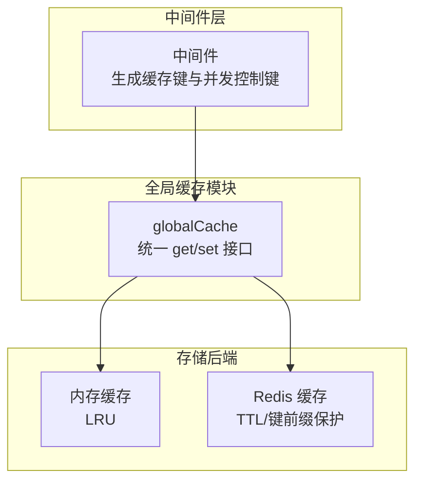
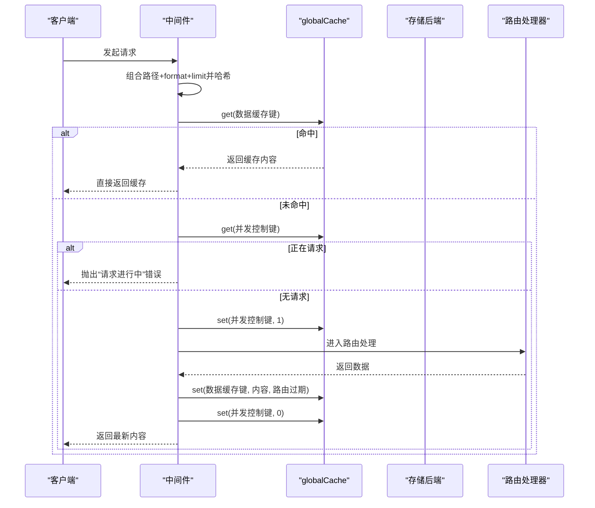
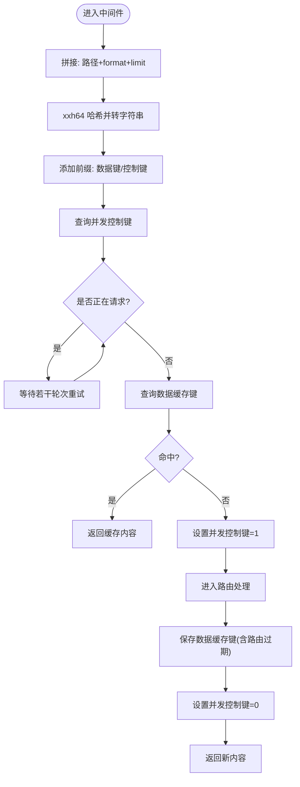
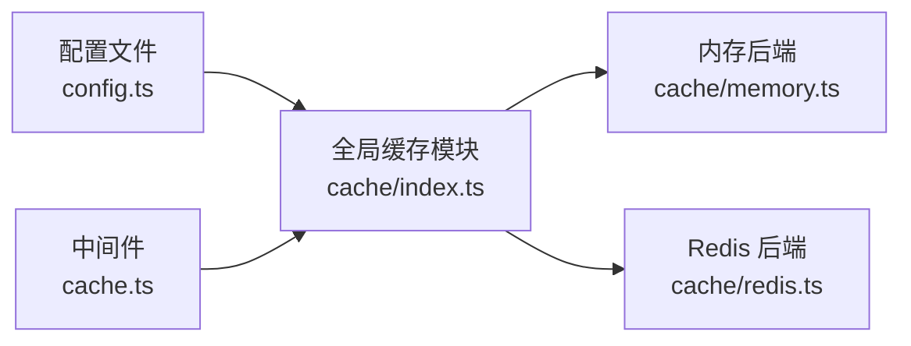

# 缓存键策略

<cite>
**本文引用的文件**
- [lib/middleware/cache.ts](file://lib/middleware/cache.ts)
- [lib/utils/cache/index.ts](file://lib/utils/cache/index.ts)
- [lib/utils/cache/redis.ts](file://lib/utils/cache/redis.ts)
- [lib/utils/cache/memory.ts](file://lib/utils/cache/memory.ts)
- [lib/config.ts](file://lib/config.ts)
- [lib/routes/test/index.ts](file://lib/routes/test/index.ts)
- [lib/routes/gov/cac/index.ts](file://lib/routes/gov/cac/index.ts)
- [lib/middleware/cache.test.ts](file://lib/middleware/cache.test.ts)
- [lib/utils/cache.test.ts](file://lib/utils/cache.test.ts)
</cite>

## 目录
1. [简介](#简介)
2. [项目结构](#项目结构)
3. [核心组件](#核心组件)
4. [架构总览](#架构总览)
5. [详细组件分析](#详细组件分析)
6. [依赖关系分析](#依赖关系分析)
7. [性能考量](#性能考量)
8. [故障排查指南](#故障排查指南)
9. [结论](#结论)
10. [附录](#附录)

## 简介
本文件系统化梳理 RSSHub 的缓存键生成策略与实现，重点覆盖：
- 缓存键命名规范与生成规则
- 哈希算法与长度压缩策略
- 配置文件对缓存键策略的影响
- 唯一性保障机制（并发控制键、请求去重）
- 不同路由与参数组合下的缓存键生成逻辑
- 提升缓存命中率的实践建议

## 项目结构
RSSHub 的缓存体系由“中间件层 + 全局缓存模块 + 后端存储（内存/Redis）”构成：
- 中间件负责在路由处理前后注入缓存键，并进行并发控制
- 全局缓存模块根据配置选择具体存储后端
- 存储后端负责 KV 的读写与过期管理

图表来源
- [lib/middleware/cache.ts](file://lib/middleware/cache.ts#L1-L84)
- [lib/utils/cache/index.ts](file://lib/utils/cache/index.ts#L1-L101)
- [lib/utils/cache/memory.ts](file://lib/utils/cache/memory.ts#L1-L45)
- [lib/utils/cache/redis.ts](file://lib/utils/cache/redis.ts#L1-L78)

章节来源
- [lib/middleware/cache.ts](file://lib/middleware/cache.ts#L1-L84)
- [lib/utils/cache/index.ts](file://lib/utils/cache/index.ts#L1-L101)

## 核心组件
- 中间件缓存键生成：基于请求路径、格式参数、限制参数，经哈希函数生成短键；同时生成并发控制键用于请求去重
- 全局缓存模块：根据配置选择内存或 Redis，提供统一的 get/set 接口
- 存储后端：内存缓存采用 LRU，Redis 缓存支持 TTL 与键前缀保护

章节来源
- [lib/middleware/cache.ts](file://lib/middleware/cache.ts#L1-L84)
- [lib/utils/cache/index.ts](file://lib/utils/cache/index.ts#L1-L101)
- [lib/utils/cache/memory.ts](file://lib/utils/cache/memory.ts#L1-L45)
- [lib/utils/cache/redis.ts](file://lib/utils/cache/redis.ts#L1-L78)

## 架构总览
中间件在每次请求进入路由处理前，计算两个键：
- 数据缓存键：用于存放 RSS 内容
- 并发控制键：用于标记当前路径是否正在被请求，避免雪崩

图表来源
- [lib/middleware/cache.ts](file://lib/middleware/cache.ts#L1-L84)
- [lib/utils/cache/index.ts](file://lib/utils/cache/index.ts#L1-L101)

## 详细组件分析

### 中间件：缓存键生成与并发控制
- 键组成要素
  - 路径：ctx.req.path
  - format：ctx.req.query('format') 或默认 rss
  - limit：ctx.req.query('limit')，存在则参与键生成
- 哈希与长度压缩
  - 使用 xxhash-wasm 的 64 位哈希，将上述字符串拼接后哈希，再转为字符串，显著缩短键长度
- 前缀与命名
  - 数据缓存键前缀：rsshub:koa-redis-cache:
  - 并发控制键前缀：rsshub:path-requested:
- 并发控制
  - 若并发控制键为 1，则等待一段时间后重试；若仍为 1 则抛错，避免同一路径的并发风暴
  - 成功获取数据后，设置并发控制键为 0，释放后续请求

图表来源
- [lib/middleware/cache.ts](file://lib/middleware/cache.ts#L1-L84)

章节来源
- [lib/middleware/cache.ts](file://lib/middleware/cache.ts#L1-L84)

### 全局缓存模块：统一接口与配置驱动
- 类型选择
  - CACHE_TYPE=redis：使用 Redis 后端
  - CACHE_TYPE=memory：使用内存后端
  - 其他/空：禁用缓存，但并发控制仍生效
- get/set 行为
  - get 支持 refresh 参数，用于命中时刷新过期时间
  - set 默认使用内容过期时间，若指定最大年龄则覆盖
- tryGet 辅助方法
  - 当键不存在时调用回调生成数据并缓存
  - 键必须为字符串，否则抛错
  - 自动 JSON 解析缓存值，便于对象缓存

章节来源
- [lib/utils/cache/index.ts](file://lib/utils/cache/index.ts#L1-L101)
- [lib/utils/cache.test.ts](file://lib/utils/cache.test.ts#L37-L92)

### 存储后端：内存与 Redis
- 内存缓存（LRU）
  - 初始化时设置 TTL 与容量上限
  - get 支持 refresh 控制命中时是否更新年龄
- Redis 缓存
  - 连接状态监听：错误/断开/连接成功
  - get：命中时根据内部 TTL 键刷新主键过期
  - set：当 maxAge 与默认内容过期不一致时，额外写入 TTL 键
  - 键前缀保护：禁止用户直接使用 rsshub:cacheTtl: 前缀

章节来源
- [lib/utils/cache/memory.ts](file://lib/utils/cache/memory.ts#L1-L45)
- [lib/utils/cache/redis.ts](file://lib/utils/cache/redis.ts#L1-L78)
- [lib/utils/cache.test.ts](file://lib/utils/cache.test.ts#L37-L92)

### 配置文件：缓存键策略的可定制点
- 缓存类型与过期
  - CACHE_TYPE：memory/redis/其他
  - CACHE_EXPIRE：路由缓存过期（秒）
  - CACHE_CONTENT_EXPIRE：内容缓存过期（秒）
  - CACHE_REQUEST_TIMEOUT：并发控制键超时（秒）
- 内存缓存容量
  - MEMORY_MAX：LRU 最大项数
- Redis 地址
  - REDIS_URL：Redis 连接串

章节来源
- [lib/config.ts](file://lib/config.ts#L735-L764)

### 路由与参数：不同组合下的缓存键生成
- 路由级缓存
  - 通过 cache.tryGet 可以按需为特定任务生成稳定键，例如 gov:cac:pathList
- 测试路由中的键使用
  - test 路由演示了 cache.get/tryGet 的典型用法，包括传入字符串键与对象值
- 参数影响
  - 中间件会把 format、limit 纳入键生成，因此相同路径+不同 format/limit 会产生不同缓存键
  - 未命中时中间件会设置并发控制键，避免同一路径并发风暴

章节来源
- [lib/routes/gov/cac/index.ts](file://lib/routes/gov/cac/index.ts#L17-L49)
- [lib/routes/test/index.ts](file://lib/routes/test/index.ts#L99-L148)
- [lib/middleware/cache.ts](file://lib/middleware/cache.ts#L1-L84)

### 唯一性与并发控制机制
- 数据键唯一性
  - 由路径+format+limit三元组决定，且经哈希压缩，天然具备唯一性
- 并发控制键
  - 用于防止同一路径在同一时刻被多个请求同时拉取，避免雪崩
  - 通过设置/清除 1/0 实现“只让一个请求去抓取”的效果
- 错误处理
  - 若并发控制键持续为 1，中间件抛出“请求进行中”错误
  - 单测验证了 URL 作为键会触发类型错误

章节来源
- [lib/middleware/cache.ts](file://lib/middleware/cache.ts#L1-L84)
- [lib/middleware/cache.test.ts](file://lib/middleware/cache.test.ts#L132-L171)
- [lib/utils/cache/index.ts](file://lib/utils/cache/index.ts#L75-L98)

## 依赖关系分析
- 中间件依赖全局缓存模块，后者再依赖具体存储后端
- 配置文件决定全局缓存模块的行为（类型、过期、容量等）

图表来源
- [lib/config.ts](file://lib/config.ts#L735-L764)
- [lib/utils/cache/index.ts](file://lib/utils/cache/index.ts#L1-L101)
- [lib/utils/cache/memory.ts](file://lib/utils/cache/memory.ts#L1-L45)
- [lib/utils/cache/redis.ts](file://lib/utils/cache/redis.ts#L1-L78)
- [lib/middleware/cache.ts](file://lib/middleware/cache.ts#L1-L84)

章节来源
- [lib/config.ts](file://lib/config.ts#L735-L764)
- [lib/utils/cache/index.ts](file://lib/utils/cache/index.ts#L1-L101)
- [lib/middleware/cache.ts](file://lib/middleware/cache.ts#L1-L84)

## 性能考量
- 哈希压缩
  - 使用 xxh64 将较长的路径+参数组合压缩为固定长度字符串，降低键长度与存储压力
- 并发控制
  - 通过并发控制键避免同一路径的并发风暴，提升整体吞吐
- 过期策略
  - 路由缓存与内容缓存分离，可根据业务特性分别设置
- 存储选择
  - Redis 适合分布式部署与高并发场景；内存缓存适合单实例与低延迟场景

[本节为通用指导，无需列出具体文件来源]

## 故障排查指南
- “请求进行中”错误
  - 现象：同一路径短时间内并发请求导致
  - 处理：等待请求完成或调整 CACHE_REQUEST_TIMEOUT
- Redis 连接异常
  - 现象：日志出现 Redis 错误/断开
  - 处理：检查 REDIS_URL 与网络连通性
- 键前缀冲突
  - 现象：尝试访问 rsshub:cacheTtl:* 前缀会报错
  - 处理：不要使用保留前缀
- 键类型错误
  - 现象：传入 URL 对象作为键会触发类型错误
  - 处理：确保键为字符串

章节来源
- [lib/middleware/cache.ts](file://lib/middleware/cache.ts#L1-L84)
- [lib/utils/cache/redis.ts](file://lib/utils/cache/redis.ts#L1-L78)
- [lib/utils/cache.test.ts](file://lib/utils/cache.test.ts#L37-L92)
- [lib/middleware/cache.test.ts](file://lib/middleware/cache.test.ts#L132-L171)

## 结论
RSSHub 的缓存键策略以“路径+格式+限制”为核心，结合 xxh64 哈希实现短键与唯一性；通过并发控制键有效避免雪崩；配置文件提供了灵活的存储与过期策略。在实际使用中，应关注参数差异对缓存键的影响，并合理设置过期时间与并发控制键超时，以获得更高的命中率与稳定性。

[本节为总结，无需列出具体文件来源]

## 附录

### 缓存键命名规范与生成规则
- 基本组成：路径 + format + limit
- 哈希算法：xxh64
- 键前缀：
  - 数据缓存键：rsshub:koa-redis-cache:
  - 并发控制键：rsshub:path-requested:
- 唯一性保障：
  - 三元组唯一 + 哈希压缩
  - 并发控制键避免同一路径并发风暴

章节来源
- [lib/middleware/cache.ts](file://lib/middleware/cache.ts#L1-L84)

### 通过配置文件自定义缓存键生成方式
- 可配置项
  - CACHE_TYPE：memory/redis/其他
  - CACHE_EXPIRE：路由缓存过期（秒）
  - CACHE_CONTENT_EXPIRE：内容缓存过期（秒）
  - CACHE_REQUEST_TIMEOUT：并发控制键超时（秒）
  - MEMORY_MAX：内存缓存容量
  - REDIS_URL：Redis 地址
- 影响范围
  - 全局缓存模块行为（类型、过期、容量）
  - 中间件并发控制键超时

章节来源
- [lib/config.ts](file://lib/config.ts#L735-L764)

### 不同路由与参数组合下的缓存键生成逻辑
- 路由级缓存：使用 cache.tryGet 按需生成稳定键
- 中间件缓存：format/limit 参与键生成，相同路径不同参数产生不同键
- 测试路由：演示了字符串键与对象值的缓存使用

章节来源
- [lib/routes/gov/cac/index.ts](file://lib/routes/gov/cac/index.ts#L17-L49)
- [lib/routes/test/index.ts](file://lib/routes/test/index.ts#L99-L148)
- [lib/middleware/cache.ts](file://lib/middleware/cache.ts#L1-L84)

### 优化缓存键设计以提高缓存命中率的实践建议
- 规范化参数
  - 对于可选参数，尽量保持默认值一致，减少键数量
- 合理设置过期
  - 静态内容使用更长的内容过期，动态内容使用较短的路由过期
- 分离缓存粒度
  - 将“路由级别”与“内容级别”缓存分离，避免不必要的重复抓取
- 并发控制
  - 适当增大 CACHE_REQUEST_TIMEOUT，平衡吞吐与一致性

[本节为通用指导，无需列出具体文件来源]