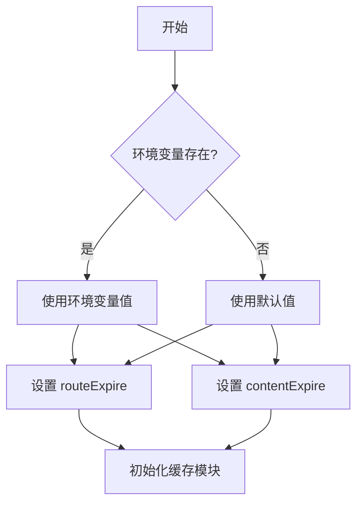
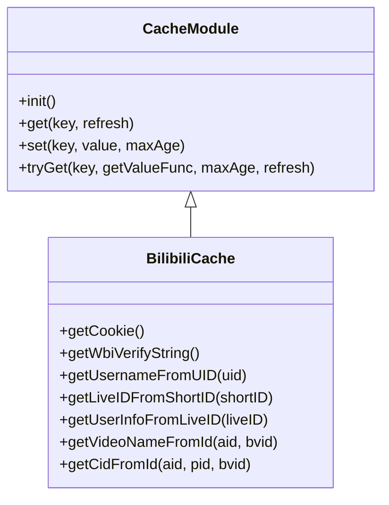
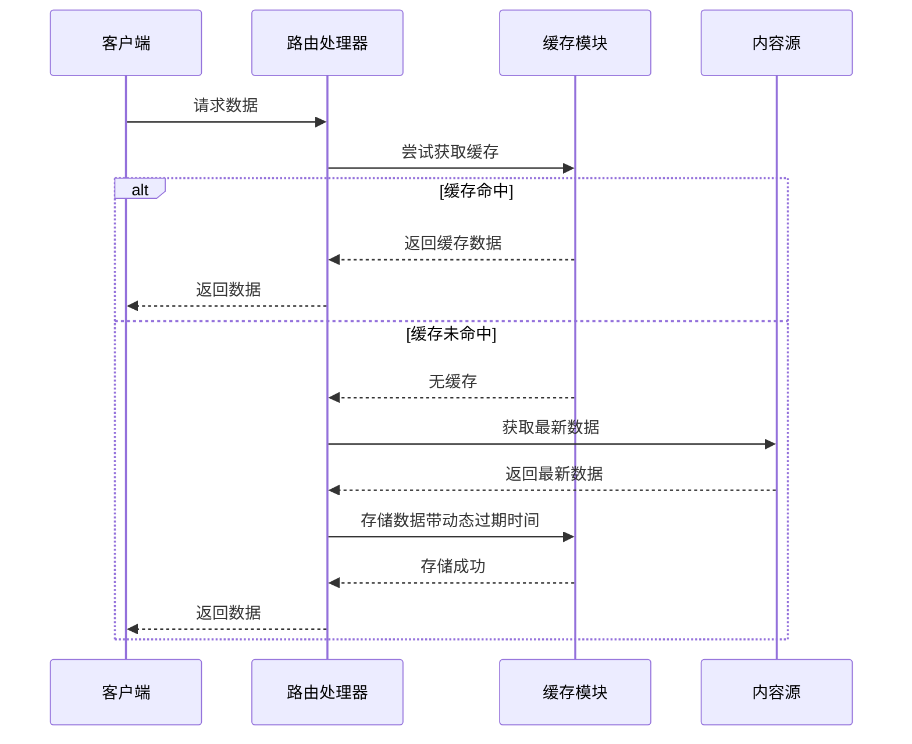
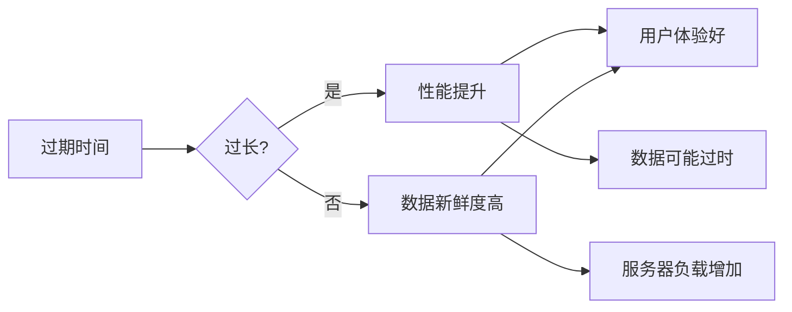

# 过期策略

<cite>
**本文档引用的文件**  
- [cache.ts](file://lib/middleware/cache.ts)
- [config.ts](file://lib/config.ts)
- [index.ts](file://lib/utils/cache/index.ts)
- [memory.ts](file://lib/utils/cache/memory.ts)
- [redis.ts](file://lib/utils/cache/redis.ts)
- [cache.test.ts](file://lib/middleware/cache.test.ts)
- [cache.ts](file://lib/routes/bilibili/cache.ts)
</cite>

## 目录
1. [引言](#引言)
2. [默认过期时间配置](#默认过期时间配置)
3. [个性化过期策略设置](#个性化过期策略设置)
4. [动态过期时间计算方法](#动态过期时间计算方法)
5. [过期时间对系统性能和数据新鲜度的影响](#过期时间对系统性能和数据新鲜度的影响)
6. [最佳实践建议](#最佳实践建议)
7. [结论](#结论)

## 引言
RSSHub 是一个开源的 RSS 生成器，旨在为各种网站和平台提供 RSS 订阅支持。为了提高性能和用户体验，RSSHub 实现了缓存机制来存储已生成的 RSS 内容。缓存过期时间的设置是该机制中的关键部分，它决定了缓存数据的有效期限。合理的过期时间设置可以在保证数据新鲜度的同时，减少不必要的重复请求，从而提升系统性能。本文将详细阐述 RSSHub 的缓存过期时间设置机制，包括默认配置、个性化策略、动态计算方法以及对系统性能和数据新鲜度的影响，并提供最佳实践建议。

## 默认过期时间配置
RSSHub 的缓存过期时间通过环境变量进行配置，主要涉及两个参数：`CACHE_EXPIRE` 和 `CACHE_CONTENT_EXPIRE`。这两个参数分别对应配置文件中的 `routeExpire` 和 `contentExpire` 属性。

- `CACHE_EXPIRE`（`routeExpire`）：定义了路由缓存的过期时间，单位为秒。默认值为 5 分钟（300 秒）。这个值用于控制整个路由响应的缓存时间。
- `CACHE_CONTENT_EXPIRE`（`contentExpire`）：定义了不变内容的缓存过期时间，单位为秒。默认值为 1 小时（3600 秒）。这个值通常用于缓存那些不经常变化的内容。

这些默认值在 `lib/config.ts` 文件中定义，并可以通过环境变量进行覆盖。例如，在测试环境中，可以将 `CACHE_EXPIRE` 设置为 1 秒，`CACHE_CONTENT_EXPIRE` 设置为 2 秒，以便快速验证缓存行为。

**Diagram sources**
- [config.ts](file://lib/config.ts#L737-L739)

**Section sources**
- [config.ts](file://lib/config.ts#L737-L739)

## 个性化过期策略设置
除了全局的默认配置外，RSSHub 还允许根据不同内容源的特点设置个性化的过期策略。这主要通过在具体路由实现中调用缓存模块的 `tryGet` 方法来实现。`tryGet` 方法允许指定特定的缓存键、获取数据的函数以及自定义的最大年龄（maxAge）。

例如，在 `lib/routes/bilibili/cache.ts` 文件中，可以看到多个使用 `tryGet` 方法的例子。每个例子都根据具体的数据类型和更新频率设置了不同的缓存时间。比如，获取用户信息可能设置较长的缓存时间，而获取实时直播状态则可能设置较短的缓存时间。

**Diagram sources**
- [index.ts](file://lib/utils/cache/index.ts#L75-L98)
- [cache.ts](file://lib/routes/bilibili/cache.ts#L37-L389)

**Section sources**
- [index.ts](file://lib/utils/cache/index.ts#L75-L98)
- [cache.ts](file://lib/routes/bilibili/cache.ts#L37-L389)

## 动态过期时间计算方法
RSSHub 的缓存过期时间不仅可以通过静态配置来设置，还可以基于内容更新频率进行动态计算。这种动态计算方法通常在路由处理逻辑中实现，根据内容的实际变化情况调整缓存时间。

例如，在处理某些频繁更新的内容源时，可以设置较短的缓存时间以确保数据的新鲜度；而对于更新较少的内容源，则可以设置较长的缓存时间以减少服务器负载。此外，还可以结合外部因素（如用户访问频率、内容重要性等）来进一步优化过期时间的计算。

在 `lib/utils/cache/index.ts` 中，`tryGet` 方法的 `maxAge` 参数允许传入动态计算出的值。这意味着开发者可以根据业务逻辑灵活地决定每个缓存项的过期时间。

**Diagram sources**
- [index.ts](file://lib/utils/cache/index.ts#L75-L98)

**Section sources**
- [index.ts](file://lib/utils/cache/index.ts#L75-L98)

## 过期时间对系统性能和数据新鲜度的影响
缓存过期时间的设置直接影响到系统的性能和数据的新鲜度。过长的过期时间虽然可以显著减少对后端服务的请求次数，提高响应速度，但可能导致用户看到过时的数据。相反，过短的过期时间虽然能保证数据的新鲜度，但会增加服务器的负载，降低整体性能。

因此，需要在性能和数据新鲜度之间找到一个平衡点。对于更新频率较高的内容源，建议设置较短的过期时间；而对于更新频率较低的内容源，则可以设置较长的过期时间。同时，还可以利用缓存预热、异步更新等技术手段来进一步优化性能。

**Diagram sources**
- [cache.ts](file://lib/middleware/cache.ts#L75-L76)

**Section sources**
- [cache.ts](file://lib/middleware/cache.ts#L75-L76)

## 最佳实践建议
为了更好地利用 RSSHub 的缓存机制，以下是一些最佳实践建议：

1. **合理设置默认过期时间**：根据应用的具体需求，合理设置 `CACHE_EXPIRE` 和 `CACHE_CONTENT_EXPIRE` 的默认值。一般情况下，`CACHE_EXPIRE` 可以设置为几分钟，`CACHE_CONTENT_EXPIRE` 可以设置为几小时。
2. **针对不同内容源定制过期策略**：对于更新频繁的内容源，使用较短的过期时间；对于更新较少的内容源，使用较长的过期时间。
3. **利用动态计算方法**：在路由处理逻辑中，根据内容的实际变化情况动态计算过期时间，以达到最佳的性能和数据新鲜度平衡。
4. **监控缓存命中率**：定期检查缓存的命中率，如果发现命中率过低，可能需要调整过期时间或优化缓存策略。
5. **考虑使用 Redis 作为缓存后端**：相比内存缓存，Redis 提供了更强大的功能和更好的持久性，适合大规模部署。

**Section sources**
- [config.ts](file://lib/config.ts#L737-L739)
- [index.ts](file://lib/utils/cache/index.ts#L75-L98)
- [cache.ts](file://lib/routes/bilibili/cache.ts#L37-L389)

## 结论
RSSHub 的缓存过期时间设置机制提供了灵活且强大的功能，既支持全局默认配置，也支持针对不同内容源的个性化策略。通过合理设置过期时间，可以在保证数据新鲜度的同时，显著提升系统性能。未来，可以通过引入更多智能化的动态计算方法，进一步优化缓存策略，为用户提供更好的体验。