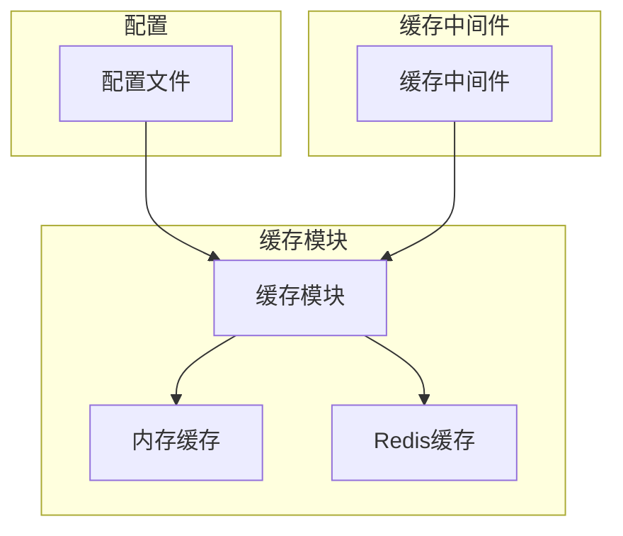

# 高级策略

<cite>
**本文档中引用的文件**  
- [cache.ts](file://lib/middleware/cache.ts)
- [config.ts](file://lib/config.ts)
- [index.ts](file://lib/utils/cache/index.ts)
- [memory.ts](file://lib/utils/cache/memory.ts)
- [redis.ts](file://lib/utils/cache/redis.ts)
- [base.ts](file://lib/utils/cache/base.ts)
</cite>

## 目录
1. [引言](#引言)
2. [缓存架构概述](#缓存架构概述)
3. [缓存预热策略](#缓存预热策略)
4. [缓存穿透防护](#缓存穿透防护)
5. [缓存雪崩应对方案](#缓存雪崩应对方案)
6. [缓存淘汰算法](#缓存淘汰算法)
7. [缓存一致性维护](#缓存一致性维护)
8. [分布式环境下的缓存同步](#分布式环境下的缓存同步)
9. [自定义缓存策略开发指南](#自定义缓存策略开发指南)
10. [性能优化建议](#性能优化建议)

## 引言
RSSHub 是一个开源的 RSS 生成器，通过高级缓存策略来提高性能和响应速度。本文档全面介绍 RSSHub 的高级缓存策略，包括缓存预热、缓存穿透防护、缓存雪崩应对方案、缓存淘汰算法的实现原理和配置方法、缓存一致性维护机制以及在分布式环境下的缓存同步策略。同时提供自定义缓存策略的开发指南和性能优化建议。

## 缓存架构概述
RSSHub 的缓存系统支持内存缓存和 Redis 缓存两种类型，通过配置文件可以灵活选择缓存类型。缓存系统的核心组件包括缓存中间件、缓存模块和缓存客户端。



**图源**  
- [cache.ts](file://lib/middleware/cache.ts#L1-L84)
- [index.ts](file://lib/utils/cache/index.ts#L1-L101)
- [config.ts](file://lib/config.ts#L735-L768)

**节源**  
- [cache.ts](file://lib/middleware/cache.ts#L1-L84)
- [index.ts](file://lib/utils/cache/index.ts#L1-L101)
- [config.ts](file://lib/config.ts#L735-L768)

## 缓存预热策略
缓存预热是指在系统启动或特定时间点，预先将热点数据加载到缓存中，以减少首次访问时的延迟。RSSHub 通过配置文件中的 `CACHE_EXPIRE` 和 `CACHE_CONTENT_EXPIRE` 参数来控制缓存的有效时间，从而实现缓存预热。

**节源**  
- [config.ts](file://lib/config.ts#L737-L739)

## 缓存穿透防护
缓存穿透是指查询一个不存在的数据，由于缓存中没有该数据，每次请求都会直接访问数据库，导致数据库压力增大。RSSHub 通过在缓存中存储空值或默认值来防止缓存穿透，确保即使查询不存在的数据，也能从缓存中获取响应。

**节源**  
- [cache.ts](file://lib/middleware/cache.ts#L46-L54)

## 缓存雪崩应对方案
缓存雪崩是指大量缓存在同一时间失效，导致所有请求都直接访问数据库，造成数据库压力剧增。RSSHub 通过设置不同的缓存过期时间（`routeExpire` 和 `contentExpire`）来避免缓存雪崩，确保缓存的过期时间分散，减少同时失效的风险。

**节源**  
- [config.ts](file://lib/config.ts#L738-L739)

## 缓存淘汰算法
RSSHub 使用 LRU（Least Recently Used）算法作为缓存淘汰策略。LRU 算法会优先淘汰最近最少使用的数据，确保缓存中保留最常用的数据。在内存缓存中，通过 `lru-cache` 库实现 LRU 算法；在 Redis 缓存中，通过 Redis 的内置机制实现。

```mermaid
classDiagram
class LRUCache {
+ttl : number
+max : number
+get(key : string, refresh : boolean) : string | null
+set(key : string, value : string | Record<string, any>, maxAge : number) : any
}
class MemoryCache {
+clients : { memoryCache? : LRUCache<any, any> }
+status : { available : boolean }
+init() : void
+get(key : string, refresh : boolean) : string | null
+set(key : string, value : string | Record<string, any>, maxAge : number) : any
}
class RedisCache {
+clients : { redisClient? : Redis }
+status : { available : boolean }
+init() : void
+get(key : string, refresh : boolean) : Promise<string | null>
+set(key : string, value : string | Record<string, any>, maxAge : number) : any
}
MemoryCache --> LRUCache : "使用"
RedisCache --> Redis : "使用"
```

**图源**  
- [memory.ts](file://lib/utils/cache/memory.ts#L1-L45)
- [redis.ts](file://lib/utils/cache/redis.ts#L1-L78)
- [base.ts](file://lib/utils/cache/base.ts#L1-L17)

**节源**  
- [memory.ts](file://lib/utils/cache/memory.ts#L1-L45)
- [redis.ts](file://lib/utils/cache/redis.ts#L1-L78)
- [base.ts](file://lib/utils/cache/base.ts#L1-L17)

## 缓存一致性维护
缓存一致性是指缓存中的数据与数据库中的数据保持一致。RSSHub 通过在数据更新时同步更新缓存来维护缓存一致性。当数据发生变化时，系统会自动更新缓存中的对应数据，确保缓存与数据库的一致性。

**节源**  
- [cache.ts](file://lib/middleware/cache.ts#L70-L76)

## 分布式环境下的缓存同步
在分布式环境下，多个实例可能同时访问和修改缓存，需要确保缓存的一致性。RSSHub 通过使用 Redis 作为共享缓存，确保所有实例都能访问同一份缓存数据。Redis 的原子操作和事务机制保证了缓存操作的原子性和一致性。

**节源**  
- [redis.ts](file://lib/utils/cache/redis.ts#L1-L78)

## 自定义缓存策略开发指南
开发者可以通过扩展缓存模块来实现自定义的缓存策略。具体步骤如下：
1. 创建新的缓存模块，实现 `CacheModule` 接口。
2. 在 `index.ts` 中注册新的缓存模块。
3. 通过配置文件选择新的缓存类型。

**节源**  
- [index.ts](file://lib/utils/cache/index.ts#L1-L101)
- [base.ts](file://lib/utils/cache/base.ts#L1-L17)

## 性能优化建议
1. **合理设置缓存过期时间**：根据数据的更新频率和重要性，合理设置 `routeExpire` 和 `contentExpire` 参数。
2. **使用合适的缓存类型**：对于小规模应用，可以使用内存缓存；对于大规模应用，推荐使用 Redis 缓存。
3. **监控缓存命中率**：定期监控缓存的命中率，及时调整缓存策略。
4. **避免缓存穿透**：对于查询不存在的数据，可以在缓存中存储空值或默认值。
5. **避免缓存雪崩**：通过设置不同的缓存过期时间，避免大量缓存同时失效。

**节源**  
- [config.ts](file://lib/config.ts#L735-L768)
- [cache.ts](file://lib/middleware/cache.ts#L1-L84)