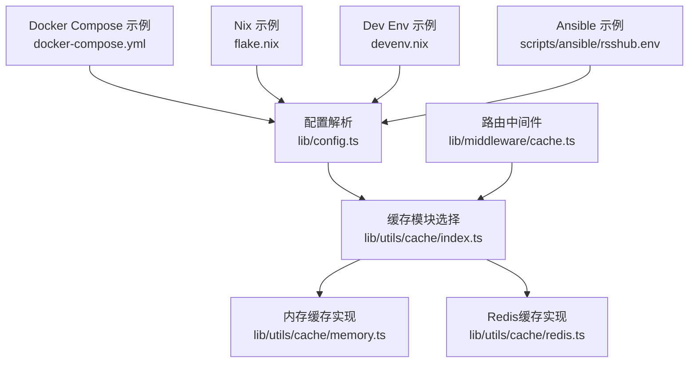
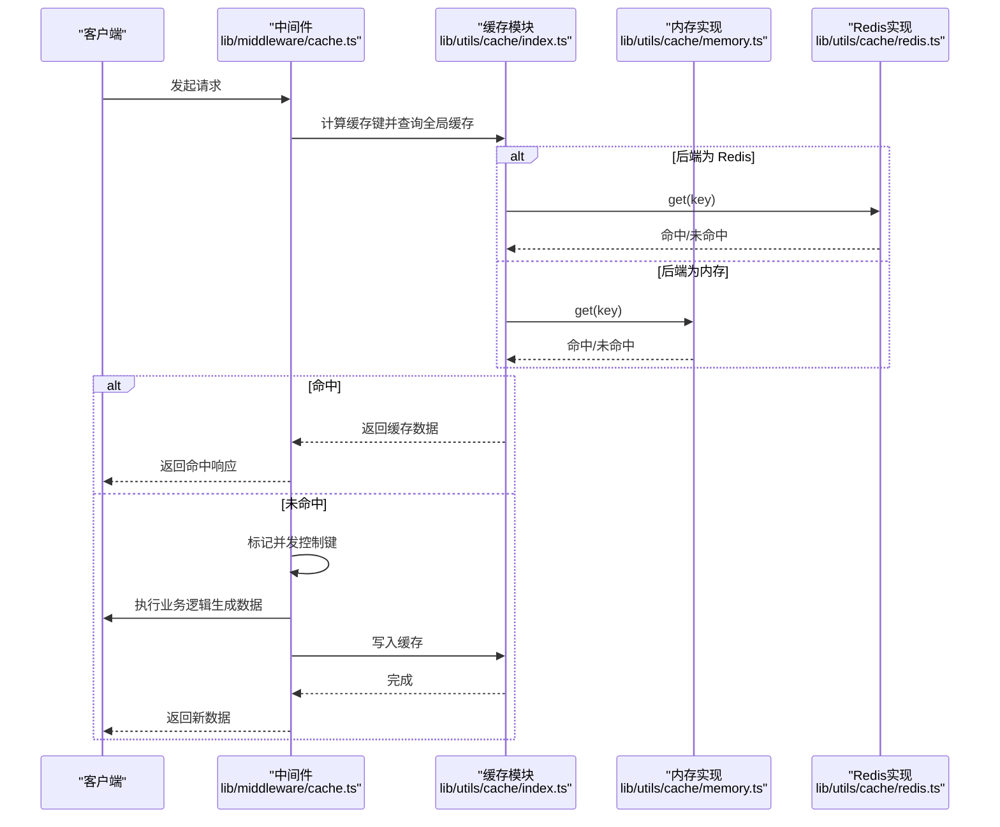
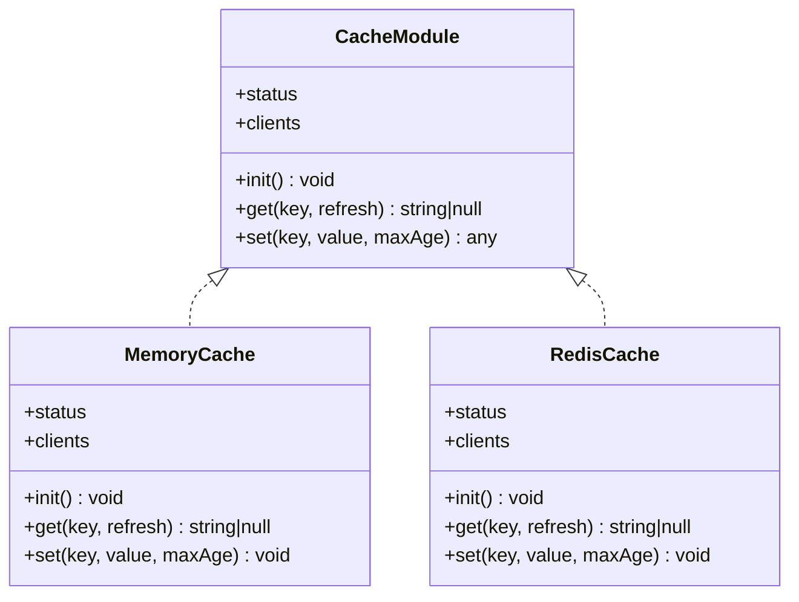
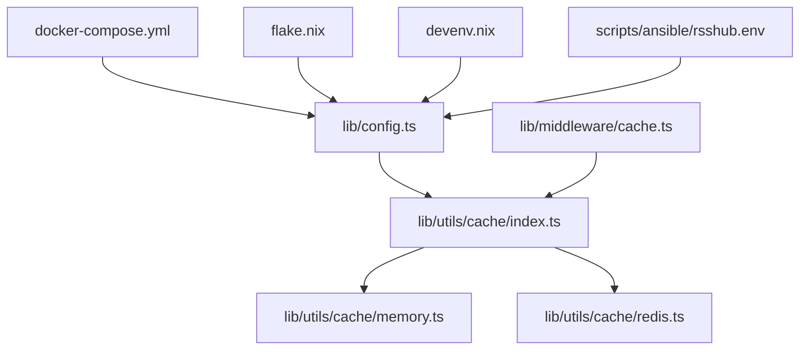

# 缓存类型配置

<cite>
**本文引用的文件列表**
- [lib/config.ts](file://lib/config.ts)
- [lib/utils/cache/base.ts](file://lib/utils/cache/base.ts)
- [lib/utils/cache/index.ts](file://lib/utils/cache/index.ts)
- [lib/utils/cache/memory.ts](file://lib/utils/cache/memory.ts)
- [lib/utils/cache/redis.ts](file://lib/utils/cache/redis.ts)
- [lib/middleware/cache.ts](file://lib/middleware/cache.ts)
- [docker-compose.yml](file://docker-compose.yml)
- [flake.nix](file://flake.nix)
- [devenv.nix](file://devenv.nix)
- [scripts/ansible/rsshub.env](file://scripts/ansible/rsshub.env)
- [lib/middleware/cache.test.ts](file://lib/middleware/cache.test.ts)
- [lib/utils/cache.test.ts](file://lib/utils/cache.test.ts)
</cite>

## 目录
1. [简介](#简介)
2. [项目结构与入口](#项目结构与入口)
3. [核心组件总览](#核心组件总览)
4. [架构概览](#架构概览)
5. [详细组件分析](#详细组件分析)
6. [依赖关系分析](#依赖关系分析)
7. [性能与适用场景](#性能与适用场景)
8. [配置示例与最佳实践](#配置示例与最佳实践)
9. [故障排查指南](#故障排查指南)
10. [结论](#结论)

## 简介
本文件系统性说明 RSSHub 支持的缓存类型与配置方法，重点覆盖：
- 缓存类型：内存缓存与 Redis 缓存
- 配置项：CACHE_TYPE、CACHE_EXPIRE、CACHE_CONTENT_EXPIRE、CACHE_REQUEST_TIMEOUT、MEMORY_MAX、REDIS_URL
- 使用场景：单实例、多实例、高并发、分布式部署
- 性能特征：命中率、延迟、容量与持久化差异
- 配置示例：通过环境变量在不同部署方式中启用与切换缓存后端

## 项目结构与入口
RSSHub 的缓存子系统由“配置解析 → 缓存模块选择 → 中间件拦截 → 全局缓存读写”构成，关键文件如下：
- 配置解析：lib/config.ts
- 缓存模块选择与封装：lib/utils/cache/index.ts
- 缓存接口定义：lib/utils/cache/base.ts
- 内存缓存实现：lib/utils/cache/memory.ts
- Redis 缓存实现：lib/utils/cache/redis.ts
- 路由中间件：lib/middleware/cache.ts
- 部署示例：docker-compose.yml、flake.nix、devenv.nix、scripts/ansible/rsshub.env
- 测试用例：lib/middleware/cache.test.ts、lib/utils/cache.test.ts

图表来源
- [lib/config.ts](file://lib/config.ts#L735-L747)
- [lib/utils/cache/index.ts](file://lib/utils/cache/index.ts#L1-L60)
- [lib/utils/cache/memory.ts](file://lib/utils/cache/memory.ts#L1-L45)
- [lib/utils/cache/redis.ts](file://lib/utils/cache/redis.ts#L1-L78)
- [lib/middleware/cache.ts](file://lib/middleware/cache.ts#L1-L84)
- [docker-compose.yml](file://docker-compose.yml#L10-L14)
- [flake.nix](file://flake.nix#L152-L188)
- [devenv.nix](file://devenv.nix#L28-L32)
- [scripts/ansible/rsshub.env](file://scripts/ansible/rsshub.env#L1-L4)

章节来源
- [lib/config.ts](file://lib/config.ts#L735-L747)
- [lib/utils/cache/index.ts](file://lib/utils/cache/index.ts#L1-L60)
- [lib/middleware/cache.ts](file://lib/middleware/cache.ts#L1-L84)

## 核心组件总览
- 配置层：从环境变量读取并构造运行期配置对象，包含缓存类型、过期策略、内存上限、Redis 地址等。
- 模块层：根据配置动态选择内存或 Redis 实现，并统一暴露 init/get/set/status/clients 接口。
- 中间件层：对路由请求进行缓存命中检测、并发控制、缓存写入与响应头标注。

章节来源
- [lib/config.ts](file://lib/config.ts#L735-L747)
- [lib/utils/cache/base.ts](file://lib/utils/cache/base.ts#L1-L18)
- [lib/utils/cache/index.ts](file://lib/utils/cache/index.ts#L1-L60)
- [lib/middleware/cache.ts](file://lib/middleware/cache.ts#L1-L84)

## 架构概览
下图展示了从请求到缓存读写的完整流程，以及两种后端的差异点。

图表来源
- [lib/middleware/cache.ts](file://lib/middleware/cache.ts#L1-L84)
- [lib/utils/cache/index.ts](file://lib/utils/cache/index.ts#L1-L60)
- [lib/utils/cache/memory.ts](file://lib/utils/cache/memory.ts#L1-L45)
- [lib/utils/cache/redis.ts](file://lib/utils/cache/redis.ts#L1-L78)

## 详细组件分析

### 配置解析与参数
- 缓存类型选择：当 CACHE_TYPE 为空字符串时禁用缓存；默认为 memory。
- 过期策略：
  - 路由级过期：CACHE_EXPIRE（单位秒），用于中间件缓存键的 TTL。
  - 内容级过期：CACHE_CONTENT_EXPIRE（单位秒），用于内容缓存的 TTL。
- 并发控制超时：CACHE_REQUEST_TIMEOUT（单位秒），用于并发冲突控制键的 TTL。
- 内存缓存上限：MEMORY_MAX，LRU 最大条目数。
- Redis 连接：REDIS_URL，默认本地 redis://localhost:6379/。

章节来源
- [lib/config.ts](file://lib/config.ts#L735-L747)

### 缓存模块选择与封装
- 当 CACHE_TYPE 为 redis：初始化 Redis 客户端，get/set 通过 Redis 客户端执行。
- 当 CACHE_TYPE 为 memory：初始化 LRU 缓存，get/set 通过内存缓存执行。
- 其他情况：禁用缓存，记录错误日志。

章节来源
- [lib/utils/cache/index.ts](file://lib/utils/cache/index.ts#L1-L60)

### 内存缓存实现
- 初始化：基于配置的 routeExpire 与 memory.max 构建 LRU 实例。
- 读取：支持 refresh 参数决定是否刷新 TTL。
- 写入：自动将对象序列化为字符串，按 contentExpire 设置 TTL。

章节来源
- [lib/utils/cache/memory.ts](file://lib/utils/cache/memory.ts#L1-L45)

### Redis 缓存实现
- 初始化：创建 Redis 客户端，监听连接事件以更新可用状态。
- 读取：同时获取键与其 TTL 键，命中时可按 TTL 刷新键与 TTL 键。
- 写入：若 maxAge 非默认值，则额外写入 TTL 键；否则不写入 TTL 键以节省空间。
- 关键限制：内部使用特定前缀的 TTL 键，禁止外部使用相同前缀。

章节来源
- [lib/utils/cache/redis.ts](file://lib/utils/cache/redis.ts#L1-L78)

### 路由中间件与并发控制
- 缓存键计算：基于路径、format、limit 的哈希生成唯一键。
- 并发控制：使用控制键标记当前路径正在请求，避免雪崩。
- 命中处理：命中则直接返回缓存数据并设置响应头。
- 写入策略：仅在非 no-cache 且存在数据时写入缓存。

章节来源
- [lib/middleware/cache.ts](file://lib/middleware/cache.ts#L1-L84)

### 类关系图

图表来源
- [lib/utils/cache/base.ts](file://lib/utils/cache/base.ts#L1-L18)
- [lib/utils/cache/memory.ts](file://lib/utils/cache/memory.ts#L1-L45)
- [lib/utils/cache/redis.ts](file://lib/utils/cache/redis.ts#L1-L78)

## 依赖关系分析
- 配置依赖：所有缓存行为均依赖 lib/config.ts 中的运行期配置。
- 模块依赖：lib/utils/cache/index.ts 统一导出 tryGet 与 globalCache，并根据配置选择具体实现。
- 中间件依赖：lib/middleware/cache.ts 依赖缓存模块与配置，负责并发控制与响应头标注。
- 部署依赖：docker-compose.yml、flake.nix、devenv.nix、scripts/ansible/rsshub.env 提供环境变量示例。

图表来源
- [lib/config.ts](file://lib/config.ts#L735-L747)
- [lib/utils/cache/index.ts](file://lib/utils/cache/index.ts#L1-L60)
- [lib/middleware/cache.ts](file://lib/middleware/cache.ts#L1-L84)
- [docker-compose.yml](file://docker-compose.yml#L10-L14)
- [flake.nix](file://flake.nix#L152-L188)
- [devenv.nix](file://devenv.nix#L28-L32)
- [scripts/ansible/rsshub.env](file://scripts/ansible/rsshub.env#L1-L4)

## 性能与适用场景
- 内存缓存
  - 特点：低延迟、高吞吐、无网络开销；进程内 LRU，重启丢失。
  - 适用：单实例、开发/测试、低并发、无需跨进程共享缓存。
  - 参数：MEMORY_MAX 控制容量；CACHE_EXPIRE/CACHE_CONTENT_EXPIRE 控制 TTL。
- Redis 缓存
  - 特点：持久化、跨进程/跨实例共享、支持复杂 TTL 策略；引入网络延迟与连接管理。
  - 适用：生产多实例、高并发、需要缓存持久化的场景。
  - 参数：REDIS_URL 指向 Redis；CACHE_EXPIRE/CACHE_CONTENT_EXPIRE 控制 TTL；CACHE_REQUEST_TIMEOUT 控制并发冲突键 TTL。
- 并发控制
  - 中间件通过控制键避免同一路径的并发请求风暴，提升稳定性与一致性。

章节来源
- [lib/middleware/cache.ts](file://lib/middleware/cache.ts#L1-L84)
- [lib/utils/cache/memory.ts](file://lib/utils/cache/memory.ts#L1-L45)
- [lib/utils/cache/redis.ts](file://lib/utils/cache/redis.ts#L1-L78)

## 配置示例与最佳实践

### 在 config.ts 中设置缓存参数
- 缓存类型：通过环境变量 CACHE_TYPE 指定，支持 "memory"、"redis" 或空字符串禁用。
- 过期时间：CACHE_EXPIRE（路由级）、CACHE_CONTENT_EXPIRE（内容级）。
- 并发控制：CACHE_REQUEST_TIMEOUT（并发冲突键 TTL）。
- 内存上限：MEMORY_MAX（LRU 最大条目数）。
- Redis 地址：REDIS_URL（默认 redis://localhost:6379/）。

章节来源
- [lib/config.ts](file://lib/config.ts#L735-L747)

### 在 Docker Compose 中启用 Redis 缓存
- 将服务 rsshub 的环境变量设置为：
  - CACHE_TYPE=redis
  - REDIS_URL=redis://redis:6379/
- 同时启动独立的 redis 服务容器。

章节来源
- [docker-compose.yml](file://docker-compose.yml#L10-L14)
- [docker-compose.yml](file://docker-compose.yml#L49-L60)

### 在 Nix 开发环境中启用 Redis
- 可通过 flake.nix 的 redis.enable 与 redis.url 配置 RSSHub 的缓存后端。
- 示例环境变量：
  - CACHE_TYPE=redis
  - REDIS_URL=redis://localhost:6379/

章节来源
- [flake.nix](file://flake.nix#L152-L188)

### 在 Dev Env（devenv.nix）中启用本地 Redis
- 可在 devenv.nix 中启用本地 Redis 服务，RSSHub 默认连接本地端口。
- 开发时可直接使用内存缓存或本地 Redis。

章节来源
- [devenv.nix](file://devenv.nix#L28-L32)

### 在 Ansible/脚本中设置环境变量
- scripts/ansible/rsshub.env 中示例：
  - NODE_ENV=production
  - CACHE_TYPE=redis
  - PUPPETEER_WS_ENDPOINT=ws://localhost:3000

章节来源
- [scripts/ansible/rsshub.env](file://scripts/ansible/rsshub.env#L1-L4)

### 配置要点与建议
- 单实例/开发：优先使用内存缓存，简单高效。
- 生产/多实例：使用 Redis，确保缓存跨实例共享与持久化。
- 高并发：合理设置 CACHE_REQUEST_TIMEOUT，避免并发风暴。
- 内容稳定性：对不变内容使用较长的 CACHE_CONTENT_EXPIRE，减少上游压力。
- Redis 连接：确保 REDIS_URL 正确可达，必要时开启健康检查与重连策略。

## 故障排查指南
- 缓存未生效
  - 检查 CACHE_TYPE 是否被设为空字符串或无效值。
  - 查看中间件日志，确认缓存模块状态。
- Redis 连接失败
  - 核对 REDIS_URL 是否正确；查看 Redis 客户端错误事件。
  - 在测试中可通过退出/错误场景验证降级为无缓存的行为。
- 并发冲突
  - 观察控制键是否存在长时间为 1 的情况；适当增大 CACHE_REQUEST_TIMEOUT。
- 缓存命中异常
  - 检查路由中间件是否设置了 Cache-Control=no-cache。
  - 确认 tryGet 的 key 类型与 TTL 键前缀使用是否符合规范。

章节来源
- [lib/middleware/cache.test.ts](file://lib/middleware/cache.test.ts#L136-L190)
- [lib/utils/cache.test.ts](file://lib/utils/cache.test.ts#L37-L92)
- [lib/utils/cache/redis.ts](file://lib/utils/cache/redis.ts#L13-L18)

## 结论
- RSSHub 提供内存与 Redis 两种缓存后端，分别适用于单实例与生产多实例场景。
- 通过环境变量即可快速切换后端与调整 TTL、容量等参数。
- 中间件层提供了并发控制与命中处理，配合缓存后端可显著降低上游负载与响应延迟。
- 建议在生产环境采用 Redis，并结合合理的 TTL 与并发控制策略，确保稳定性与性能。