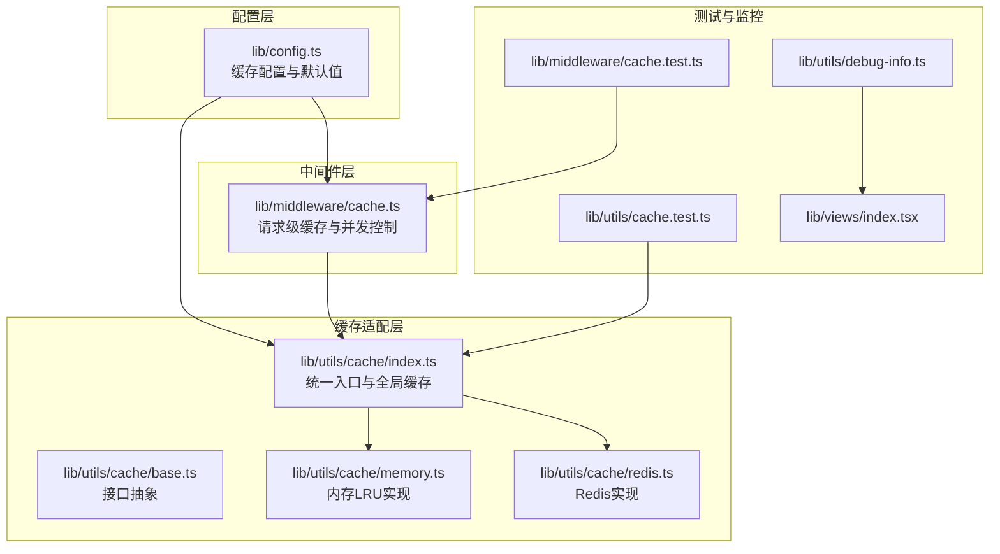
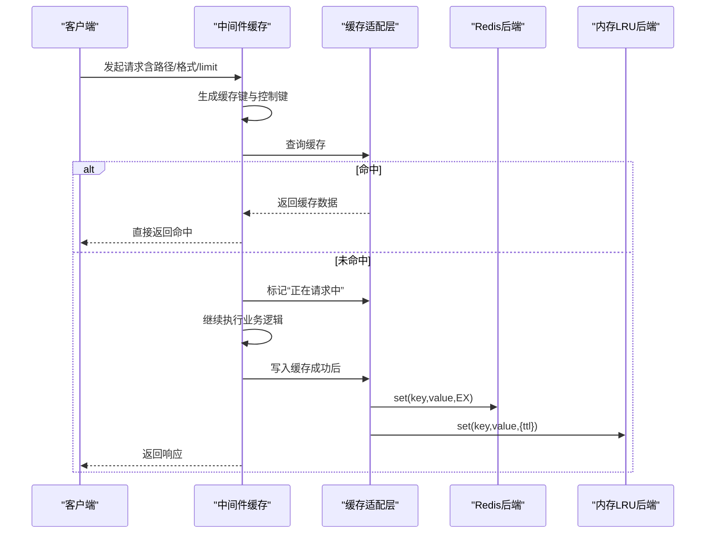
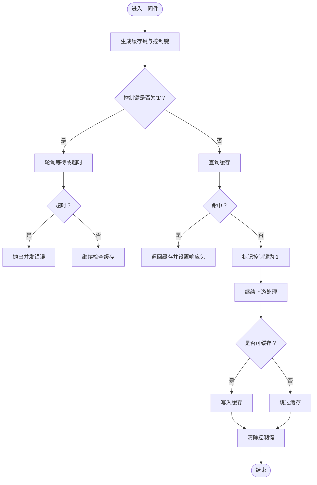
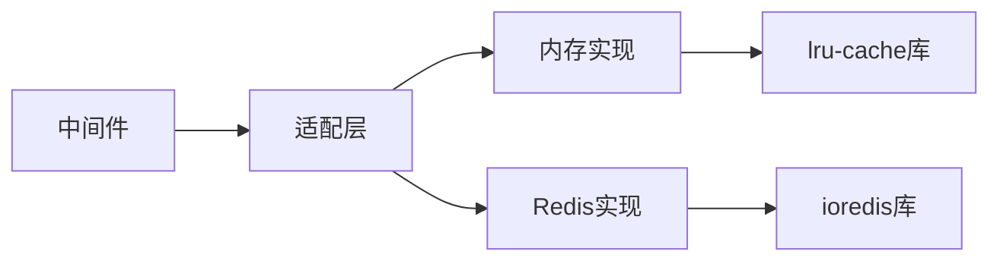

# 缓存配置

<cite>
**本文引用的文件**
- [lib/config.ts](file://lib/config.ts)
- [lib/middleware/cache.ts](file://lib/middleware/cache.ts)
- [lib/utils/cache/index.ts](file://lib/utils/cache/index.ts)
- [lib/utils/cache/base.ts](file://lib/utils/cache/base.ts)
- [lib/utils/cache/memory.ts](file://lib/utils/cache/memory.ts)
- [lib/utils/cache/redis.ts](file://lib/utils/cache/redis.ts)
- [lib/utils/cache.test.ts](file://lib/utils/cache.test.ts)
- [lib/middleware/cache.test.ts](file://lib/middleware/cache.test.ts)
- [lib/routes/test/index.ts](file://lib/routes/test/index.ts)
- [lib/views/index.tsx](file://lib/views/index.tsx)
- [lib/utils/debug-info.ts](file://lib/utils/debug-info.ts)
- [flake.nix](file://flake.nix)
</cite>

## 目录
1. [简介](#简介)
2. [项目结构](#项目结构)
3. [核心组件](#核心组件)
4. [架构总览](#架构总览)
5. [详细组件分析](#详细组件分析)
6. [依赖关系分析](#依赖关系分析)
7. [性能与容量特性](#性能与容量特性)
8. [故障排查指南](#故障排查指南)
9. [结论](#结论)
10. [附录：环境变量与默认值](#附录环境变量与默认值)

## 简介
本文件面向RSSHub使用者与运维人员，系统化梳理缓存子系统的配置项、工作机制与最佳实践。内容覆盖：
- 缓存类型与后端选择（内存LRU、Redis）
- 缓存时间与容量限制（路由级、内容级、内存最大项数）
- 缓存键策略与并发控制
- Redis连接与认证配置
- 缓存策略与安全边界（穿透、预热、失效）
- 性能监控与调优建议
- 常见问题诊断与排障

## 项目结构
缓存系统主要由以下模块构成：
- 配置层：集中定义缓存相关环境变量与默认值
- 中间件层：HTTP请求级缓存命中、并发去重、控制键管理
- 缓存适配层：统一接口抽象，分别实现内存与Redis后端
- 工具与测试：验证缓存行为、并发控制与错误处理

图表来源
- [lib/config.ts](file://lib/config.ts#L735-L768)
- [lib/middleware/cache.ts](file://lib/middleware/cache.ts#L1-L84)
- [lib/utils/cache/index.ts](file://lib/utils/cache/index.ts#L1-L101)
- [lib/utils/cache/base.ts](file://lib/utils/cache/base.ts#L1-L17)
- [lib/utils/cache/memory.ts](file://lib/utils/cache/memory.ts#L1-L45)
- [lib/utils/cache/redis.ts](file://lib/utils/cache/redis.ts#L1-L78)
- [lib/utils/cache.test.ts](file://lib/utils/cache.test.ts#L1-L92)
- [lib/middleware/cache.test.ts](file://lib/middleware/cache.test.ts#L1-L190)
- [lib/utils/debug-info.ts](file://lib/utils/debug-info.ts#L1-L24)
- [lib/views/index.tsx](file://lib/views/index.tsx#L60-L95)

章节来源
- [lib/config.ts](file://lib/config.ts#L735-L768)
- [lib/middleware/cache.ts](file://lib/middleware/cache.ts#L1-L84)
- [lib/utils/cache/index.ts](file://lib/utils/cache/index.ts#L1-L101)
- [lib/utils/cache/base.ts](file://lib/utils/cache/base.ts#L1-L17)
- [lib/utils/cache/memory.ts](file://lib/utils/cache/memory.ts#L1-L45)
- [lib/utils/cache/redis.ts](file://lib/utils/cache/redis.ts#L1-L78)
- [lib/utils/cache.test.ts](file://lib/utils/cache.test.ts#L1-L92)
- [lib/middleware/cache.test.ts](file://lib/middleware/cache.test.ts#L1-L190)
- [lib/utils/debug-info.ts](file://lib/utils/debug-info.ts#L1-L24)
- [lib/views/index.tsx](file://lib/views/index.tsx#L60-L95)

## 核心组件
- 配置层（lib/config.ts）：集中定义缓存类型、路由过期时间、内容过期时间、内存最大项数、Redis连接URL等。
- 中间件（lib/middleware/cache.ts）：基于请求路径、格式、limit参数生成稳定缓存键；通过“控制键”避免同一路径并发重复抓取；命中则直接返回缓存数据。
- 适配层（lib/utils/cache/index.ts）：根据配置选择内存或Redis后端；提供tryGet便捷方法；暴露globalCache用于跨模块读写。
- 内存后端（lib/utils/cache/memory.ts）：基于LRU缓存，支持TTL与最大项数限制。
- Redis后端（lib/utils/cache/redis.ts）：基于ioredis，自动维护键TTL与“缓存TTL键”，防止用户自定义键冲突。
- 测试（lib/utils/cache.test.ts、lib/middleware/cache.test.ts）：覆盖内存/Redis行为、并发控制、错误场景与RSS TTL影响。
- 监控（lib/utils/debug-info.ts、lib/views/index.tsx）：统计命中率、错误率、热路由等指标。

章节来源
- [lib/config.ts](file://lib/config.ts#L735-L768)
- [lib/middleware/cache.ts](file://lib/middleware/cache.ts#L1-L84)
- [lib/utils/cache/index.ts](file://lib/utils/cache/index.ts#L1-L101)
- [lib/utils/cache/memory.ts](file://lib/utils/cache/memory.ts#L1-L45)
- [lib/utils/cache/redis.ts](file://lib/utils/cache/redis.ts#L1-L78)
- [lib/utils/cache.test.ts](file://lib/utils/cache.test.ts#L1-L92)
- [lib/middleware/cache.test.ts](file://lib/middleware/cache.test.ts#L1-L190)
- [lib/utils/debug-info.ts](file://lib/utils/debug-info.ts#L1-L24)
- [lib/views/index.tsx](file://lib/views/index.tsx#L60-L95)

## 架构总览
缓存工作流分为两条主线：
- 请求级缓存（中间件）：对每个RSS/Feed请求生成稳定键，命中即返回；未命中则标记“正在请求中”，并发请求等待或报错；成功后写入缓存。
- 数据级缓存（适配层）：提供统一get/set/tryGet接口，按配置选择内存或Redis；Redis额外维护“缓存TTL键”以支持非默认过期时间。

图表来源
- [lib/middleware/cache.ts](file://lib/middleware/cache.ts#L1-L84)
- [lib/utils/cache/index.ts](file://lib/utils/cache/index.ts#L1-L101)
- [lib/utils/cache/redis.ts](file://lib/utils/cache/redis.ts#L1-L78)
- [lib/utils/cache/memory.ts](file://lib/utils/cache/memory.ts#L1-L45)

## 详细组件分析

### 配置与默认值（lib/config.ts）
- 缓存类型：CACHE_TYPE（支持'memory'、'redis'、空字符串禁用）
- 路由缓存过期：CACHE_EXPIRE（单位秒，默认5分钟）
- 内容缓存过期：CACHE_CONTENT_EXPIRE（单位秒，默认1小时）
- 内存最大项数：MEMORY_MAX（默认较小值）
- Redis连接：REDIS_URL（默认本地地址）

章节来源
- [lib/config.ts](file://lib/config.ts#L735-L768)

### 请求级缓存中间件（lib/middleware/cache.ts）
- 键策略：基于请求路径、format、limit参数，经哈希生成稳定键；同时维护一个“正在请求中”的控制键，避免并发重复抓取。
- 并发控制：若检测到控制键为“正在请求”，在限定时间内轮询等待；超时则抛出特定错误。
- 命中处理：命中时设置响应头并直接返回缓存数据。
- 写入缓存：仅当响应未显式禁止缓存且存在数据时写入。

图表来源
- [lib/middleware/cache.ts](file://lib/middleware/cache.ts#L1-L84)

章节来源
- [lib/middleware/cache.ts](file://lib/middleware/cache.ts#L1-L84)

### 缓存适配层（lib/utils/cache/index.ts）
- 后端选择：根据配置选择Redis或内存实现；否则返回不可用状态。
- 全局缓存：提供globalCache读写能力，供中间件与业务模块共享。
- tryGet：缓存未命中时调用回调函数获取数据并写入缓存，支持指定maxAge与刷新策略。

章节来源
- [lib/utils/cache/index.ts](file://lib/utils/cache/index.ts#L1-L101)

### 接口抽象（lib/utils/cache/base.ts）
- 定义init/get/set/status/clients的标准接口，确保内存与Redis实现一致。

章节来源
- [lib/utils/cache/base.ts](file://lib/utils/cache/base.ts#L1-L17)

### 内存后端（lib/utils/cache/memory.ts）
- 使用LRU缓存，支持TTL与最大项数限制；get/set均支持refresh参数以更新TTL。

章节来源
- [lib/utils/cache/memory.ts](file://lib/utils/cache/memory.ts#L1-L45)

### Redis后端（lib/utils/cache/redis.ts）
- 连接与事件：初始化时建立连接，监听error/end/connect事件；可用性状态随事件变化。
- 键策略：内部维护“缓存TTL键”，用于记录非默认过期时间；禁止用户使用保留前缀。
- 刷新逻辑：命中时根据“缓存TTL键”或默认值重置主键TTL；set时若maxAge非默认则同步写入“缓存TTL键”。

章节来源
- [lib/utils/cache/redis.ts](file://lib/utils/cache/redis.ts#L1-L78)

### 测试与验证（lib/utils/cache.test.ts、lib/middleware/cache.test.ts）
- 行为验证：覆盖内存/Redis后端、并发控制、错误场景（连接断开、URL错误）、RSS TTL影响。
- 关键断言：命中返回头、TTL键保留规则、无缓存模式下的行为差异。

章节来源
- [lib/utils/cache.test.ts](file://lib/utils/cache.test.ts#L1-L92)
- [lib/middleware/cache.test.ts](file://lib/middleware/cache.test.ts#L1-L190)

### 监控与调试（lib/utils/debug-info.ts、lib/views/index.tsx）
- 指标统计：命中次数、请求总数、ETag匹配、错误数、热路由/热路径等。
- 可视化展示：在管理界面汇总展示命中率、健康度等关键指标。

章节来源
- [lib/utils/debug-info.ts](file://lib/utils/debug-info.ts#L1-L24)
- [lib/views/index.tsx](file://lib/views/index.tsx#L60-L95)

## 依赖关系分析
- 中间件依赖缓存适配层提供的globalCache与状态
- 适配层根据配置选择具体后端实现
- Redis后端依赖ioredis库，内存后端依赖lru-cache库
- 测试用例覆盖中间件与适配层的关键分支

图表来源
- [lib/middleware/cache.ts](file://lib/middleware/cache.ts#L1-L84)
- [lib/utils/cache/index.ts](file://lib/utils/cache/index.ts#L1-L101)
- [lib/utils/cache/memory.ts](file://lib/utils/cache/memory.ts#L1-L45)
- [lib/utils/cache/redis.ts](file://lib/utils/cache/redis.ts#L1-L78)

章节来源
- [lib/middleware/cache.ts](file://lib/middleware/cache.ts#L1-L84)
- [lib/utils/cache/index.ts](file://lib/utils/cache/index.ts#L1-L101)
- [lib/utils/cache/memory.ts](file://lib/utils/cache/memory.ts#L1-L45)
- [lib/utils/cache/redis.ts](file://lib/utils/cache/redis.ts#L1-L78)

## 性能与容量特性
- 内存缓存
  - 特点：低延迟、高吞吐；受进程内存限制；重启丢失。
  - 容量：由MEMORY_MAX限制LRU项数；TTL按路由/内容过期时间生效。
- Redis缓存
  - 特点：持久化、可横向扩展、跨进程共享；网络延迟与连接池开销。
  - TTL：默认内容过期时间；可通过tryGet/maxAge单独设置。
  - 键空间：内部使用“缓存TTL键”存储非默认过期时间，避免用户键冲突。
- 并发控制
  - 控制键避免同一路径并发抓取，减少抖动与资源浪费。
- RSS TTL影响
  - 在启用缓存时，RSS输出的ttl会反映缓存命中与过期策略的影响。

章节来源
- [lib/config.ts](file://lib/config.ts#L735-L768)
- [lib/middleware/cache.ts](file://lib/middleware/cache.ts#L1-L84)
- [lib/utils/cache/memory.ts](file://lib/utils/cache/memory.ts#L1-L45)
- [lib/utils/cache/redis.ts](file://lib/utils/cache/redis.ts#L1-L78)
- [lib/middleware/cache.test.ts](file://lib/middleware/cache.test.ts#L173-L189)

## 故障排查指南
- Redis连接异常
  - 现象：日志出现Redis错误；缓存不可用。
  - 处理：检查REDIS_URL、网络连通性、认证配置；必要时重启服务。
- 并发请求冲突
  - 现象：短时间内并发请求可能被拒绝或等待。
  - 处理：适当增大CACHE_REQUEST_TIMEOUT；优化上游抓取策略。
- 键冲突与保留前缀
  - 现象：使用保留前缀的键会触发错误。
  - 处理：不要使用以“rsshub:cacheTtl:”开头的键。
- 无缓存模式
  - 现象：RSS输出不带缓存头，ttl与预期不符。
  - 处理：确认CACHE_TYPE与CACHE_EXPIRE设置；在中间件测试中可见差异。
- 缓存穿透
  - 建议：对不存在的数据设置短寿命缓存键，降低数据库压力；结合tryGet与maxAge控制。
- 缓存预热
  - 建议：在部署后主动访问热点路由，使数据提前进入缓存。
- 缓存失效
  - 建议：通过调整CACHE_EXPIRE/CACHE_CONTENT_EXPIRE或删除对应键实现主动失效。

章节来源
- [lib/utils/cache.test.ts](file://lib/utils/cache.test.ts#L73-L92)
- [lib/middleware/cache.test.ts](file://lib/middleware/cache.test.ts#L136-L149)
- [lib/utils/cache/redis.ts](file://lib/utils/cache/redis.ts#L13-L18)

## 结论
RSSHub的缓存体系通过“请求级中间件+数据级适配层”的分层设计，在保证一致性的同时兼顾性能与可运维性。内存与Redis两种后端满足不同规模与可靠性需求；严格的键策略与并发控制有效避免了热点抖动与穿透风险。建议结合监控指标持续优化过期时间与容量参数，并在生产环境中优先采用Redis后端以获得更好的稳定性与可观测性。

## 附录：环境变量与默认值
- CACHE_TYPE：缓存类型（memory/redis/空字符串禁用）
- CACHE_REQUEST_TIMEOUT：并发控制超时（秒）
- CACHE_EXPIRE：路由缓存过期（秒）
- CACHE_CONTENT_EXPIRE：内容缓存过期（秒）
- MEMORY_MAX：内存LRU最大项数
- REDIS_URL：Redis连接URL（默认本地）

章节来源
- [lib/config.ts](file://lib/config.ts#L735-L768)
- [flake.nix](file://flake.nix#L152-L227)