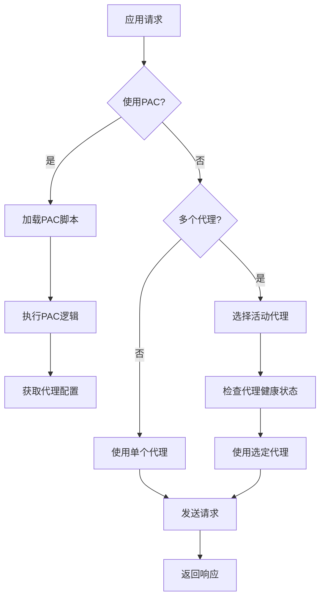

# 配置选项

<cite>
**本文档引用的文件**
- [config.ts](file://lib/config.ts)
- [rsshub.env](file://scripts/ansible/rsshub.env)
- [cache.ts](file://lib/middleware/cache.ts)
- [index.ts](file://lib/utils/cache/index.ts)
- [redis.ts](file://lib/utils/cache/redis.ts)
- [memory.ts](file://lib/utils/cache/memory.ts)
- [unify-proxy.ts](file://lib/utils/proxy/unify-proxy.ts)
- [pac-proxy.ts](file://lib/utils/proxy/pac-proxy.ts)
- [multi-proxy.ts](file://lib/utils/proxy/multi-proxy.ts)
- [index.ts](file://lib/utils/proxy/index.ts)
- [logger.ts](file://lib/utils/logger.ts)
</cite>

## 目录
1. [简介](#简介)
2. [服务器设置](#服务器设置)
3. [缓存配置](#缓存配置)
4. [代理设置](#代理设置)
5. [安全设置](#安全设置)
6. [日志配置](#日志配置)
7. [Feed配置](#feed配置)
8. [OpenAI集成](#openai集成)
9. [路由特定配置](#路由特定配置)
10. [环境变量使用方法](#环境变量使用方法)
11. [配置验证机制](#配置验证机制)
12. [最佳实践](#最佳实践)
13. [配置示例](#配置示例)

## 简介
RSSHub是一个开源的RSS生成器，支持通过环境变量进行灵活配置。本文档详细列出了RSSHub所有可配置的参数，按功能类别组织，包括服务器设置、缓存配置、代理设置、安全设置等。每个配置项都提供了详细的说明，包括默认值、可选值和使用场景。文档还解释了环境变量的使用方法，如何通过.env文件或命令行参数进行配置，并提供了生产环境和开发环境的配置示例。

## 服务器设置

### PORT
- **描述**: 服务器监听端口
- **默认值**: 1200
- **可选值**: 任意有效的端口号
- **使用场景**: 指定RSSHub服务监听的端口，当需要在特定端口运行服务时使用

### LISTEN_INADDR_ANY
- **描述**: 是否允许公网连接
- **默认值**: true
- **可选值**: true/false
- **使用场景**: 控制服务是否可以从外部网络访问，生产环境中通常设置为true

### DISALLOW_ROBOT
- **描述**: 是否禁止机器人访问
- **默认值**: false
- **可选值**: true/false
- **使用场景**: 当需要防止搜索引擎爬虫访问时设置为true

### ENABLE_CLUSTER
- **描述**: 是否启用集群模式
- **默认值**: false
- **可选值**: true/false
- **使用场景**: 在多核服务器上启用集群模式以提高性能

### NODE_NAME
- **描述**: 节点名称
- **默认值**: undefined
- **可选值**: 任意字符串
- **使用场景**: 在集群部署中标识不同节点

**Section sources**
- [config.ts](file://lib/config.ts#L239-L251)

## 缓存配置

### CACHE_TYPE
- **描述**: 缓存类型
- **默认值**: memory
- **可选值**: memory/redis/空字符串
- **使用场景**: 选择缓存后端，memory使用内存缓存，redis使用Redis服务器，空字符串禁用缓存

### CACHE_EXPIRE
- **描述**: 路由缓存时间（秒）
- **默认值**: 300 (5分钟)
- **可选值**: 任意正整数
- **使用场景**: 控制路由数据的缓存时长，较短的时间可获得更实时的数据

### CACHE_CONTENT_EXPIRE
- **描述**: 不变内容缓存时间（秒）
- **默认值**: 3600 (1小时)
- **可选值**: 任意正整数
- **使用场景**: 控制静态内容的缓存时长，较长的时间可提高性能

### MEMORY_MAX
- **描述**: 内存缓存最大项目数
- **默认值**: 256
- **可选值**: 任意正整数
- **使用场景**: 限制内存缓存的大小，防止内存耗尽

### REDIS_URL
- **描述**: Redis服务器URL
- **默认值**: redis://localhost:6379/
- **可选值**: 有效的Redis连接URL
- **使用场景**: 指定Redis服务器地址，用于分布式缓存


**Diagram sources**
- [config.ts](file://lib/config.ts#L263-L274)
- [index.ts](file://lib/utils/cache/index.ts#L18-L59)
- [redis.ts](file://lib/utils/cache/redis.ts#L20-L77)
- [memory.ts](file://lib/utils/cache/memory.ts#L12-L44)

**Section sources**
- [config.ts](file://lib/config.ts#L263-L274)

## 代理设置

### PROXY_URI
- **描述**: 代理服务器URI
- **默认值**: undefined
- **可选值**: 有效的代理服务器地址
- **使用场景**: 指定单个代理服务器地址

### PROXY_URIS
- **描述**: 多个代理服务器URI
- **默认值**: undefined
- **可选值**: 逗号分隔的代理服务器地址列表
- **使用场景**: 配置多个代理服务器实现负载均衡和故障转移

### PROXY_PROTOCOL
- **描述**: 代理协议
- **默认值**: undefined
- **可选值**: http/https/socks/socks5
- **使用场景**: 指定代理服务器使用的协议

### PROXY_HOST
- **描述**: 代理主机
- **默认值**: undefined
- **可选值**: 有效的主机地址
- **使用场景**: 指定代理服务器主机地址

### PROXY_PORT
- **描述**: 代理端口
- **默认值**: undefined
- **可选值**: 有效的端口号
- **使用场景**: 指定代理服务器端口

### PROXY_AUTH
- **描述**: 代理认证信息
- **默认值**: undefined
- **可选值**: base64编码的用户名:密码
- **使用场景**: 当代理服务器需要认证时使用

### PROXY_URL_REGEX
- **描述**: 代理URL正则表达式
- **默认值**: .*
- **可选值**: 有效的正则表达式
- **使用场景**: 指定哪些URL需要通过代理访问

### PROXY_STRATEGY
- **描述**: 代理策略
- **默认值**: all
- **可选值**: all/on_retry
- **使用场景**: all表示所有请求都通过代理，on_retry表示仅在请求失败时使用代理

### PROXY_FAILOVER_TIMEOUT
- **描述**: 代理故障转移超时时间（毫秒）
- **默认值**: 5000
- **可选值**: 任意正整数
- **使用场景**: 控制代理服务器故障后的重试时间

### PROXY_HEALTH_CHECK_INTERVAL
- **描述**: 代理健康检查间隔（毫秒）
- **默认值**: 60000
- **可选值**: 任意正整数
- **使用场景**: 控制代理服务器健康检查的频率

### PAC_URI
- **描述**: PAC文件URI
- **默认值**: undefined
- **可选值**: 有效的PAC文件URL
- **使用场景**: 使用PAC文件自动配置代理

### PAC_SCRIPT
- **描述**: PAC脚本内容
- **默认值**: undefined
- **可选值**: JavaScript代码
- **使用场景**: 直接提供PAC脚本内容



**Diagram sources**
- [config.ts](file://lib/config.ts#L276-L289)
- [unify-proxy.ts](file://lib/utils/proxy/unify-proxy.ts#L34-L61)
- [pac-proxy.ts](file://lib/utils/proxy/pac-proxy.ts#L6-L34)
- [multi-proxy.ts](file://lib/utils/proxy/multi-proxy.ts#L25-L140)
- [index.ts](file://lib/utils/proxy/index.ts#L34-L142)

**Section sources**
- [config.ts](file://lib/config.ts#L276-L289)

## 安全设置

### ACCESS_KEY
- **描述**: 访问密钥
- **默认值**: undefined
- **可选值**: 任意字符串
- **使用场景**: 保护RSSHub实例，只有提供正确密钥的请求才能访问

### DISABLE_NSFW
- **描述**: 禁用NSFW内容
- **默认值**: false
- **可选值**: true/false
- **使用场景**: 防止生成包含成人内容的RSS源

### ALLOW_USER_SUPPLY_UNSAFE_DOMAIN
- **描述**: 允许用户提供不安全域名
- **默认值**: false
- **可选值**: true/false
- **使用场景**: 控制是否允许用户在请求中指定任意域名

**Section sources**
- [config.ts](file://lib/config.ts#L291-L292)

## 日志配置

### DEBUG_INFO
- **描述**: 调试信息显示
- **默认值**: true
- **可选值**: true/false/自定义字符串
- **使用场景**: 控制调试信息的显示，true表示永久显示，false表示永远隐藏，自定义字符串表示需要在请求中包含特定参数才显示

### LOGGER_LEVEL
- **描述**: 日志级别
- **默认值**: info
- **可选值**: error/warn/info/http/verbose/debug/silly
- **使用场景**: 控制日志输出的详细程度

### NO_LOGFILES
- **描述**: 不创建日志文件
- **默认值**: false
- **可选值**: true/false
- **使用场景**: 在不需要持久化日志的环境中设置为true

### SHOW_LOGGER_TIMESTAMP
- **描述**: 显示日志时间戳
- **默认值**: false
- **可选值**: true/false
- **使用场景**: 控制日志输出是否包含时间戳

### SENTRY
- **描述**: Sentry DSN
- **默认值**: undefined
- **可选值**: 有效的Sentry DSN
- **使用场景**: 集成Sentry进行错误跟踪

### SENTRY_ROUTE_TIMEOUT
- **描述**: Sentry路由超时时间（毫秒）
- **默认值**: 30000
- **可选值**: 任意正整数
- **使用场景**: 控制Sentry监控的超时阈值

### ENABLE_REMOTE_DEBUGGING
- **描述**: 启用远程调试
- **默认值**: false
- **可选值**: true/false
- **使用场景**: 在需要远程调试时启用

**Section sources**
- [config.ts](file://lib/config.ts#L293-L305)
- [logger.ts](file://lib/utils/logger.ts#L7-L48)

## Feed配置

### HOTLINK_TEMPLATE
- **描述**: 热链模板
- **默认值**: undefined
- **可选值**: 包含{img_url}占位符的URL模板
- **使用场景**: 重写图片链接，通过代理或CDN提供图片

### HOTLINK_INCLUDE_PATHS
- **描述**: 热链包含路径
- **默认值**: undefined
- **可选值**: 逗号分隔的路径列表
- **使用场景**: 指定哪些路由路径应用热链模板

### HOTLINK_EXCLUDE_PATHS
- **描述**: 热链排除路径
- **默认值**: undefined
- **可选值**: 逗号分隔的路径列表
- **使用场景**: 指定哪些路由路径不应用热链模板

### ALLOW_USER_HOTLINK_TEMPLATE
- **描述**: 允许用户自定义热链模板
- **默认值**: false
- **可选值**: true/false
- **使用场景**: 允许用户在请求中通过参数指定自己的热链模板

### FILTER_REGEX_ENGINE
- **描述**: 正则表达式引擎
- **默认值**: re2
- **可选值**: re2/javascript
- **使用场景**: 选择用于过滤的正则表达式引擎

### TITLE_LENGTH_LIMIT
- **描述**: 标题长度限制
- **默认值**: 150
- **可选值**: 任意正整数
- **使用场景**: 限制生成的RSS项标题长度

### SUFFIX
- **描述**: URL后缀
- **默认值**: undefined
- **可选值**: 任意字符串
- **使用场景**: 添加到生成的RSS URL末尾的后缀

**Section sources**
- [config.ts](file://lib/config.ts#L307-L319)

## OpenAI集成

### OPENAI_API_KEY
- **描述**: OpenAI API密钥
- **默认值**: undefined
- **可选值**: 有效的OpenAI API密钥
- **使用场景**: 启用OpenAI功能所需的认证密钥

### OPENAI_MODEL
- **描述**: OpenAI模型
- **默认值**: gpt-3.5-turbo-16k
- **可选值**: 支持的OpenAI模型名称
- **使用场景**: 指定使用的OpenAI模型

### OPENAI_TEMPERATURE
- **描述**: OpenAI温度参数
- **默认值**: 0.2
- **可选值**: 0-1之间的数值
- **使用场景**: 控制生成文本的随机性

### OPENAI_MAX_TOKENS
- **描述**: OpenAI最大令牌数
- **默认值**: 0 (无限制)
- **可选值**: 任意正整数
- **使用场景**: 限制生成文本的长度

### OPENAI_API_ENDPOINT
- **描述**: OpenAI API端点
- **默认值**: https://api.openai.com/v1
- **可选值**: 有效的API端点URL
- **使用场景**: 指定OpenAI API的地址，可用于使用兼容API的替代服务

### OPENAI_INPUT_OPTION
- **描述**: OpenAI输入选项
- **默认值**: description
- **可选值**: description/title
- **使用场景**: 指定将文章的哪部分内容发送给OpenAI处理

### OPENAI_PROMPT
- **描述**: OpenAI提示词（内容）
- **默认值**: 请总结以下文章并以markdown格式回复
- **可选值**: 任意文本
- **使用场景**: 自定义OpenAI处理文章内容时的提示词

### OPENAI_PROMPT_TITLE
- **描述**: OpenAI提示词（标题）
- **默认值**: 请将以下标题翻译成简体中文，只需回复翻译后的文本
- **可选值**: 任意文本
- **使用场景**: 自定义OpenAI处理文章标题时的提示词

**Section sources**
- [config.ts](file://lib/config.ts#L320-L329)

## 路由特定配置
RSSHub支持为特定路由配置认证信息和其他参数，这些配置通常以环境变量形式提供。

### Bilibili相关
- **BILIBILI_COOKIE_***: 为特定B站用户配置Cookie
- **BILIBILI_DM_IMG_LIST**: 弹幕图片列表
- **BILIBILI_DM_IMG_INTER**: 弹幕图片间隔

### GitHub相关
- **GITHUB_ACCESS_TOKEN**: GitHub访问令牌
- **GITEE_ACCESS_TOKEN**: Gitee访问令牌

### Twitter相关
- **TWITTER_USERNAME**: Twitter用户名
- **TWITTER_PASSWORD**: Twitter密码
- **TWITTER_AUTH_TOKEN**: Twitter认证令牌

### 微博相关
- **WEIBO_APP_KEY**: 微博应用密钥
- **WEIBO_APP_SECRET**: 微博应用密钥
- **WEIBO_COOKIES**: 微博Cookie

### 其他服务
- **TELEGRAM_TOKEN**: Telegram机器人令牌
- **YOUTUBE_KEY**: YouTube API密钥
- **ZHIHU_COOKIES**: 知乎Cookie
- **PIXIV_REFRESHTOKEN**: Pixiv刷新令牌

**Section sources**
- [config.ts](file://lib/config.ts#L79-L235)

## 环境变量使用方法
RSSHub通过环境变量进行配置，支持多种配置方式：

### .env文件
创建`.env`文件并添加配置：
```
PORT=1200
CACHE_TYPE=redis
REDIS_URL=redis://localhost:6379
ACCESS_KEY=your_access_key
```

### 命令行参数
启动时通过命令行设置环境变量：
```bash
PORT=3000 CACHE_TYPE=memory node app.js
```

### Docker环境
在Docker中使用环境变量：
```bash
docker run -d -p 1200:1200 \
  -e CACHE_TYPE=redis \
  -e REDIS_URL=redis://redis:6379 \
  -e ACCESS_KEY=your_key \
  diygod/rsshub
```

### Ansible部署
使用Ansible部署时，可以在`rsshub.env`文件中配置：
```
NODE_ENV=production
CACHE_TYPE=redis
PUPPETEER_WS_ENDPOINT=ws://localhost:3000
```

**Section sources**
- [rsshub.env](file://scripts/ansible/rsshub.env#L1-L4)

## 配置验证机制
RSSHub通过以下机制确保配置的正确性：

### 类型检查
使用TypeScript定义配置类型，确保配置项的类型正确：
```typescript
type ConfigEnvKeys = 
    | 'DISALLOW_ROBOT'
    | 'ENABLE_CLUSTER'
    | 'PORT'
    // ... 其他配置项
```

### 值转换
对环境变量进行类型转换和验证：
```typescript
const toBoolean = (value: string | undefined, defaultValue: boolean) => {
    if (value === undefined) {
        return defaultValue;
    } else {
        return value === '' || value === '0' || value === 'false' ? false : !!value;
    }
};
```

### 远程配置验证
支持从远程URL加载配置，并进行验证：
```typescript
if (envs.REMOTE_CONFIG) {
    try {
        const data = await ofetch(envs.REMOTE_CONFIG, {
            headers: {
                Authorization: `Basic ${envs.REMOTE_CONFIG_AUTH}`,
            },
        });
        if (data) {
            envs = Object.assign(envs, data);
            calculateValue();
            logger.info('Remote config loaded.');
        }
    } catch (error) {
        logger.error('Remote config load failed.', error);
    }
}
```

### 缓存配置验证
在初始化缓存时进行连接验证：
```typescript
clients.redisClient.on('error', (error) => {
    status.available = false;
    logger.error('Redis error: ', error);
});
```

**Section sources**
- [config.ts](file://lib/config.ts#L679-L685)
- [config.ts](file://lib/config.ts#L1159-L1178)
- [redis.ts](file://lib/utils/cache/redis.ts#L24-L35)

## 最佳实践

### 敏感信息保护
- 将敏感信息（如API密钥、密码）存储在环境变量中，而不是代码或配置文件中
- 使用访问密钥保护RSSHub实例，防止未授权访问
- 定期轮换API密钥和访问密钥

### 性能调优
- 在生产环境中使用Redis缓存而不是内存缓存，以支持分布式部署
- 根据服务器资源调整MEMORY_MAX值，避免内存耗尽
- 合理设置CACHE_EXPIRE和CACHE_CONTENT_EXPIRE，平衡数据实时性和性能

### 安全配置
- 在生产环境中设置ACCESS_KEY
- 考虑设置DISABLE_NSFW以防止生成不当内容
- 限制ALLOW_USER_SUPPLY_UNSAFE_DOMAIN为false，防止SSRF攻击

### 可靠性
- 配置多个代理服务器实现高可用
- 设置合理的PROXY_FAILOVER_TIMEOUT和PROXY_HEALTH_CHECK_INTERVAL
- 使用远程配置功能实现配置的集中管理

### 监控和调试
- 启用Sentry集成以捕获和分析错误
- 根据需要调整LOGGER_LEVEL，生产环境中通常使用info级别
- 在调试时使用DEBUG_INFO参数，而不是永久开启详细日志

**Section sources**
- [config.ts](file://lib/config.ts#L239-L329)

## 配置示例

### 生产环境配置
```env
# 服务器设置
PORT=1200
LISTEN_INADDR_ANY=true
ENABLE_CLUSTER=true

# 缓存配置
CACHE_TYPE=redis
CACHE_EXPIRE=300
CACHE_CONTENT_EXPIRE=3600
REDIS_URL=redis://your-redis-server:6379

# 安全设置
ACCESS_KEY=your_strong_access_key
DISABLE_NSFW=true

# 代理设置
PROXY_STRATEGY=on_retry
PROXY_FAILOVER_TIMEOUT=5000
PROXY_HEALTH_CHECK_INTERVAL=60000

# 日志配置
LOGGER_LEVEL=info
SENTRY=your_sentry_dsn

# Feed配置
TITLE_LENGTH_LIMIT=150
FILTER_REGEX_ENGINE=re2
```

### 开发环境配置
```env
# 服务器设置
PORT=3000
LISTEN_INADDR_ANY=true
DISALLOW_ROBOT=false

# 缓存配置
CACHE_TYPE=memory
CACHE_EXPIRE=60
CACHE_CONTENT_EXPIRE=300
MEMORY_MAX=128

# 安全设置
ACCESS_KEY=dev_key

# 日志配置
DEBUG_INFO=true
LOGGER_LEVEL=debug
SHOW_LOGGER_TIMESTAMP=true

# OpenAI集成
OPENAI_API_KEY=your_openai_key
OPENAI_MODEL=gpt-3.5-turbo
```

**Section sources**
- [rsshub.env](file://scripts/ansible/rsshub.env#L1-L4)