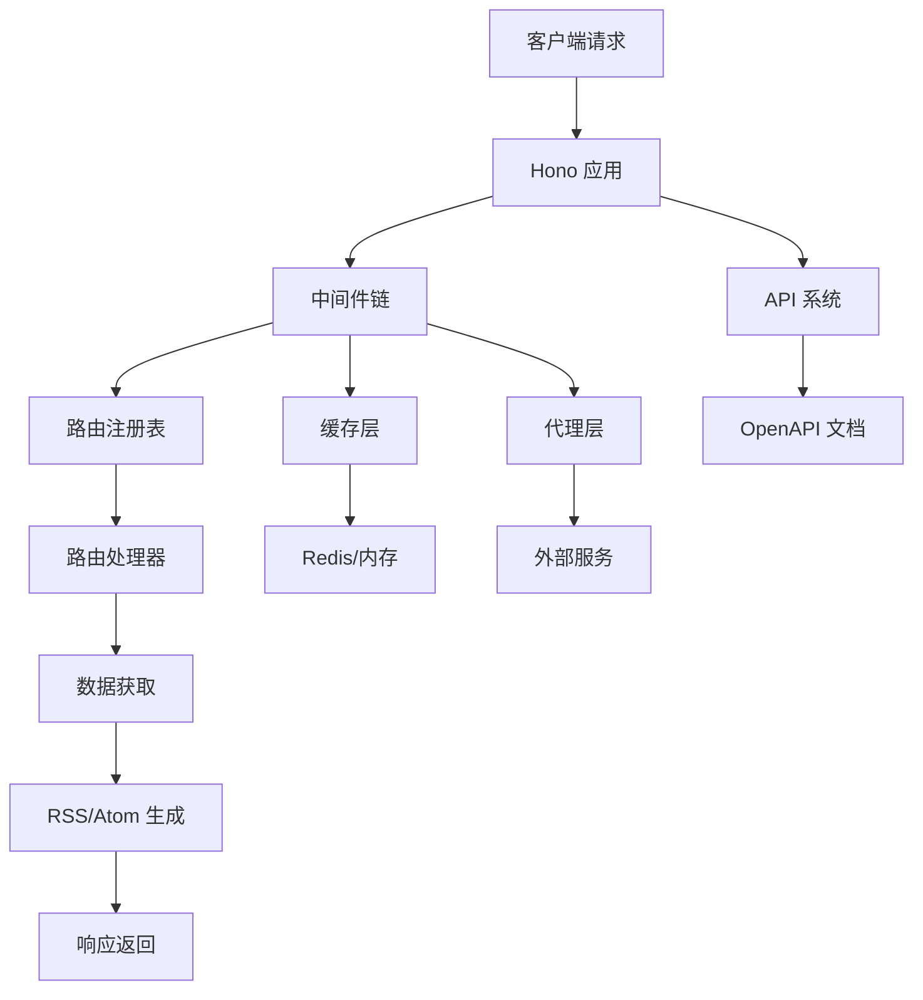

# 项目概述

<cite>
**本文档引用的文件**  
- [README.md](file://README.md)
- [package.json](file://package.json)
- [lib/app.ts](file://lib/app.ts)
- [lib/app-bootstrap.tsx](file://lib/app-bootstrap.tsx)
- [lib/config.ts](file://lib/config.ts)
- [lib/router.js](file://lib/router.js)
- [lib/registry.ts](file://lib/registry.ts)
- [lib/server.ts](file://lib/server.ts)
- [lib/middleware/cache.ts](file://lib/middleware/cache.ts)
- [lib/middleware/header.ts](file://lib/middleware/header.ts)
- [lib/middleware/template.tsx](file://lib/middleware/template.tsx)
- [lib/views/rss.tsx](file://lib/views/rss.tsx)
- [lib/views/atom.tsx](file://lib/views/atom.tsx)
- [CLAUDE.md](file://CLAUDE.md)
</cite>

## 目录
1. [引言](#引言)
2. [项目背景与目标](#项目背景与目标)
3. [核心功能](#核心功能)
4. [技术架构](#技术架构)
5. [设计哲学](#设计哲学)
6. [主要优势](#主要优势)
7. [目标用户与使用场景](#目标用户与使用场景)
8. [RSS协议基础](#rss协议基础)
9. [系统架构图](#系统架构图)
10. [实际使用案例](#实际使用案例)

## 引言

RSSHub 是一个开源、易于使用且可扩展的 RSS 生成器，旨在为任何网络内容源生成标准的 RSS 订阅源。作为世界上最大的 RSS 网络，RSSHub 由超过 5,000 个全球实例组成，每天为数百万用户提供内容聚合服务。该项目通过将各种现代网络平台的内容转换为标准 RSS 格式，解决了传统 RSS 订阅的局限性，使用户能够通过任何 RSS 阅读器订阅他们感兴趣的内容。

**Section sources**
- [README.md](file://README.md#L1-L62)

## 项目背景与目标

RSSHub 的诞生源于对信息过载和内容碎片化的应对。随着社交媒体、新闻网站和内容平台的爆炸式增长，用户面临着难以有效管理和跟踪感兴趣内容的挑战。传统的 RSS 订阅机制虽然强大，但许多现代网站和平台已经不再原生支持 RSS 功能。

RSSHub 的目标是"让万物皆可 RSS"（Everything is RSSible），通过创建一个统一的框架，将各种网络内容源转换为标准 RSS 格式。项目旨在：
- 为不支持 RSS 的网站和平台提供 RSS 订阅功能
- 创建一个开放、可扩展的内容聚合生态系统
- 促进信息的自由流动和用户对内容的自主控制
- 支持全球开发者社区共同维护和扩展路由网络

**Section sources**
- [README.md](file://README.md#L1-L62)
- [CLAUDE.md](file://CLAUDE.md#L1-L38)

## 核心功能

RSSHub 的核心功能是将各种网络内容源转换为标准 RSS 格式。项目通过一个庞大的路由系统实现了这一目标，目前支持超过 3,000 个路由，覆盖了广泛的网络平台和内容类型。

主要功能包括：
- **社交媒体聚合**：支持 Bilibili、Twitter、微博、GitHub 等社交平台的内容订阅
- **新闻资讯聚合**：提供 36氪、联合早报、澎湃新闻等新闻网站的 RSS 订阅
- **技术开发资讯**：聚合 GitHub、掘金、SegmentFault 等技术社区的内容
- **多媒体内容**：支持 Pixiv、YouTube、Spotify 等多媒体平台的内容订阅
- **学术与教育**：提供大学官网、学术期刊等教育相关内容的订阅
- **政府与公共信息**：聚合政府网站、政策文件等公共信息

RSSHub 还提供了高级参数功能，允许用户通过查询字符串进行内容过滤、格式选择和个性化配置。

**Section sources**
- [CLAUDE.md](file://CLAUDE.md#L104-L112)
- [lib/router.js](file://lib/router.js#L1-L800)

## 技术架构

RSSHub 采用现代化的技术栈构建，具有清晰的分层架构和模块化设计。项目基于 TypeScript 开发，使用 Hono 作为轻量级 Web 框架，运行在 Node.js 22+ 环境中。

### 核心组件

**应用层**：由 `app-bootstrap.tsx` 文件定义，负责应用的初始化和中间件链的配置。应用使用 Hono 框架，通过 JSX 渲染器生成 XML 响应。

**路由系统**：位于 `lib/routes/` 目录，包含超过 3,000 个路由文件。每个路由定义了特定内容源的抓取逻辑和数据处理方式。

**中间件层**：提供请求处理的通用功能，包括缓存、访问控制、日志记录、代理等。中间件链在请求到达路由处理器之前执行。

**工具库**：`lib/utils/` 目录包含通用工具函数，如 HTTP 客户端、Puppeteer 浏览器自动化、RSS 解析等。

**视图层**：`lib/views/` 目录包含 RSS 和 Atom 格式的模板，负责将数据转换为标准的 XML 输出。

### 路由实现模式

RSSHub 支持多种路由实现模式，以适应不同的内容源特性：

**API 模式**：直接调用目标平台的公开 API 获取数据，如 GitHub 路由。

**爬虫模式**：使用 Cheerio 等工具解析 HTML 页面，提取所需内容。

**混合模式**：结合 API 和爬虫技术，如 Bilibili 路由使用 WBI 验证机制。

**Puppeteer 模式**：对于需要浏览器渲染的复杂场景，使用 Puppeteer 进行页面自动化。

**Section sources**
- [CLAUDE.md](file://CLAUDE.md#L11-L38)
- [lib/app-bootstrap.tsx](file://lib/app-bootstrap.tsx#L1-L54)
- [lib/registry.ts](file://lib/registry.ts#L1-L272)

## 设计哲学

RSSHub 的设计哲学体现了对开放性、可扩展性和用户友好的追求。项目采用模块化架构，使各个组件能够独立开发和维护。

**懒加载机制**：路由处理器采用懒加载方式，只有在首次请求时才会加载相关文件，提高了应用的启动速度和内存效率。

**配置驱动**：通过环境变量和配置文件实现灵活的运行时配置，支持缓存类型、代理设置、访问控制等多种选项。

**可扩展性**：开放的路由系统允许开发者轻松添加新的内容源，促进了社区的共同维护和持续发展。

**错误处理**：完善的错误处理机制确保了系统的稳定性和可靠性，提供了详细的错误信息和调试支持。

**Section sources**
- [lib/app-bootstrap.tsx](file://lib/app-bootstrap.tsx#L1-L54)
- [lib/registry.ts](file://lib/registry.ts#L1-L272)

## 主要优势

RSSHub 具有以下主要优势：

**广泛的覆盖范围**：支持超过 3,000 个路由，涵盖社交媒体、新闻、技术、多媒体等多个领域。

**高性能**：通过内存和 Redis 缓存机制，显著提高了响应速度和系统性能。

**易用性**：简单的部署方式和直观的 API 设计，使用户能够快速上手和使用。

**可定制性**：支持多种输出格式（RSS、Atom、JSON Feed）和高级参数配置，满足不同用户的需求。

**社区驱动**：活跃的开源社区持续贡献新的路由和功能，确保项目与时俱进。

**跨平台兼容**：生成的标准 RSS 格式兼容各种 RSS 阅读器和聚合工具。

**Section sources**
- [README.md](file://README.md#L1-L62)
- [CLAUDE.md](file://CLAUDE.md#L1-L38)

## 目标用户与使用场景

RSSHub 的目标用户包括：

**个人用户**：希望使用 RSS 阅读器跟踪社交媒体、新闻网站和内容平台更新的普通用户。

**开发者**：需要集成各种内容源到自己应用中的开发者，可以使用 RSSHub 作为中间层。

**研究人员**：需要持续监控特定领域信息的研究人员和学者。

**企业用户**：希望聚合行业资讯和竞争对手动态的企业和组织。

典型使用场景包括：
- 订阅 Bilibili UP 主的最新视频
- 跟踪 GitHub 项目的更新和问题
- 获取 Twitter 上关注用户的推文
- 监控新闻网站的最新报道
- 聚合学术期刊的最新论文

**Section sources**
- [README.md](file://README.md#L1-L62)

## RSS协议基础

RSS（Really Simple Syndication）是一种用于发布经常更新的内容（如博客文章、新闻标题或视频）的 Web Feed 格式。RSS 允许用户订阅他们感兴趣的内容源，并通过 RSS 阅读器获取更新。

RSSHub 生成的标准 RSS 2.0 格式包含以下主要元素：
- **channel**：频道信息，包括标题、链接、描述等
- **item**：内容条目，每个条目包含标题、链接、描述、发布日期等
- **title**：条目标题
- **link**：条目链接
- **description**：条目描述或摘要
- **pubDate**：发布时间
- **guid**：全局唯一标识符

RSSHub 还支持 Atom 格式和 JSON Feed，提供了更多的选择和兼容性。

**Section sources**
- [lib/views/rss.tsx](file://lib/views/rss.tsx#L1-L63)
- [lib/views/atom.tsx](file://lib/views/atom.tsx#L1-L50)

## 系统架构图

**Diagram sources**
- [CLAUDE.md](file://CLAUDE.md#L19-L37)

## 实际使用案例

RSSHub 提供了丰富的实际使用案例，展示了如何通过不同的路由订阅各种平台的内容。

**社交媒体订阅**：通过 `/bilibili/user/video/:uid` 路由，可以订阅 Bilibili 用户的最新视频。用户只需将此 URL 添加到 RSS 阅读器中，即可实时获取该用户的视频更新。

**新闻资讯聚合**：使用 `/zaobao/realtime/:section` 路由，可以订阅联合早报的实时新闻。不同的参数可以指定不同的新闻板块，如中国、国际、财经等。

**技术开发跟踪**：通过 `/github/trending/:since` 路由，可以获取 GitHub 的趋势项目。参数 `since` 可以设置为 daily、weekly 或 monthly，以获取不同时间范围的趋势项目。

**多媒体内容**：使用 `/pixiv/user/:id` 路由，可以订阅 Pixiv 艺术家的最新作品。这对于关注特定艺术家的粉丝来说非常有用。

这些案例展示了 RSSHub 如何将各种网络内容源转换为标准 RSS 格式，使用户能够通过统一的界面管理和跟踪他们感兴趣的内容。

**Section sources**
- [lib/router.js](file://lib/router.js#L1-L800)
- [CLAUDE.md](file://CLAUDE.md#L104-L112)