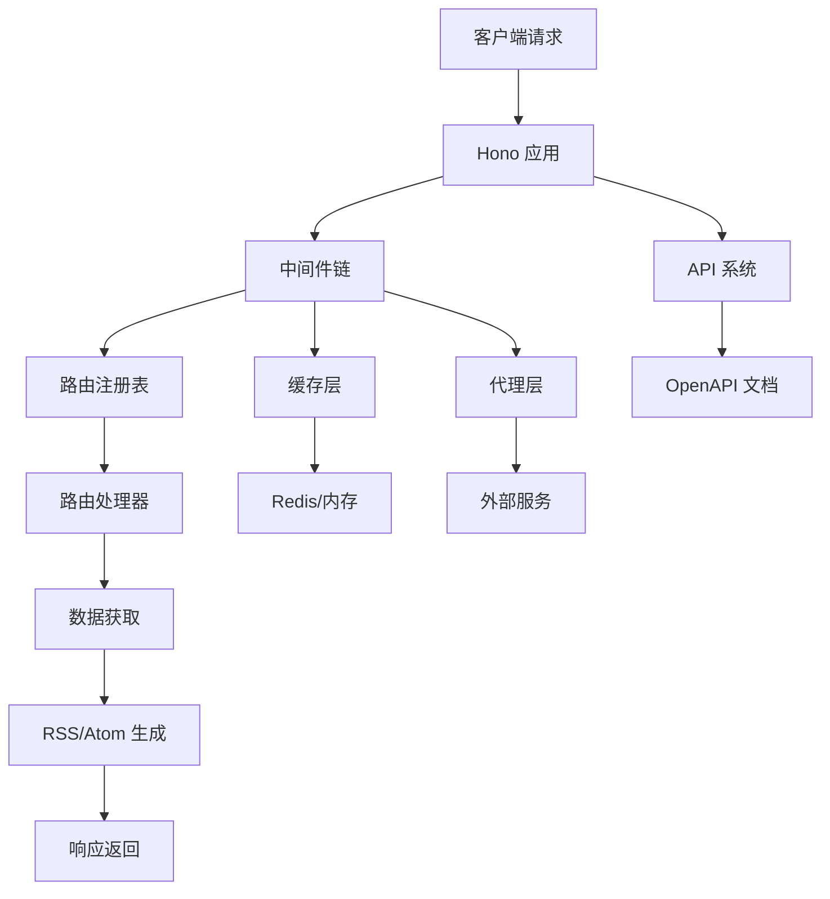

# RSSHub - 架构文档

> 更新时间：2025-12-07 15:00:00

## 项目愿景

RSSHub 是世界上最大的 RSS 网络，由超过 5,000 个全球实例组成。它提供了一个开源、易于使用、可扩展的 RSS 生成器，为任何内容生成 RSS 订阅源。

## 架构总览

### 技术栈
- **语言**: TypeScript
- **框架**: Hono (轻量级 Web 框架)
- **运行时**: Node.js 22+
- **包管理**: pnpm
- **构建工具**: tsdown

### 核心架构


### ✨ 模块结构图

```mermaid
graph TD
    A["(根) RSSHub"] --> B["lib"];
    B --> C["核心应用"];
    B --> D["路由系统"];
    B --> E["API 系统"];
    B --> F["中间件"];
    B --> G["工具库"];
    B --> H["视图层"];
    A --> I["scripts"];
    A --> J["测试"];
    A --> K["文档"];

    C --> C1["app.ts"];
    C --> C2["app-bootstrap.tsx"];
    C --> C3["registry.ts"];
    C --> C4["config.ts"];

    D --> D1["3000+ 路由"];
    D --> D2["namespace 定义"];
    D --> D3["route 处理器"];

    E --> E1["namespace API"];
    E --> E2["category API"];
    E --> E3["radar API"];

    F --> F1["访问控制"];
    F --> F2["缓存"];
    F --> F3["日志"];
    F --> F4["代理"];

    G --> G1["HTTP 客户端"];
    G --> G2["Puppeteer"];
    G --> G3["RSS 解析"];
    G --> G4["工具函数"];

    H --> H1["RSS 模板"];
    H --> H2["Atom 模板"];
    H --> H3["错误页面"];

    click C "./lib/CLAUDE.md" "查看核心模块文档"
    click D "./lib/routes/CLAUDE.md" "查看路由系统文档"
    click E "./lib/api/CLAUDE.md" "查看 API 系统文档"
    click F "./lib/middleware/CLAUDE.md" "查看中间件文档"
    click G "./lib/utils/CLAUDE.md" "查看工具库文档"
    click H "./lib/views/CLAUDE.md" "查看视图层文档"
```



## 模块索引

| 模块 | 路径 | 职责 | 关键文件 | 覆盖状态 |
|------|------|------|----------|----------|
| **核心应用** | `lib/` | 应用启动和配置管理 | app.ts, app-bootstrap.tsx, config.ts | ✅ 已扫描 |
| **路由系统** | `lib/routes/` | RSS 路由定义和处理 | 3000+ 路由文件 | ⚠️ 部分扫描 (5.3%) |
| **API 系统** | `lib/api/` | RESTful API 接口 | index.ts, namespace/, category/ | ✅ 已扫描 |
| **中间件** | `lib/middleware/` | 请求处理中间件 | cache.ts, logger.ts, access-control.ts | ✅ 已扫描 |
| **工具库** | `lib/utils/` | 通用工具函数 | got.ts, puppeteer.ts, rss-parser.ts | ✅ 已扫描 |
| **视图层** | `lib/views/` | RSS/XML 模板渲染 | rss.tsx, atom.tsx, index.tsx | ✅ 已扫描 |
| **构建脚本** | `scripts/` | 构建和部署工具 | build-routes.ts, build-docs.ts | ✅ 已扫描 |
| **测试** | `lib/*.test.ts` | 单元测试和集成测试 | 40+ 测试文件 | ⚠️ 部分扫描 |

## 路由系统深度分析

### 路由统计
- **总路由数**: 3066 个
- **已扫描**: 50 个代表性路由
- **主要分类**:
  - 社交媒体 (bilibili, twitter, weibo, github)
  - 新闻资讯 (36kr, zaobao, thepaper)
  - 技术开发 (github,掘金, segmentfault)
  - 多媒体 (pixiv, youtube, spotify)

### 路由实现模式

#### 1. API 模式 (如 GitHub)
```typescript
// 使用官方 API，稳定可靠
const response = await got('https://api.github.com/repos/:owner/:repo/issues', {
    headers: { Authorization: `token ${config.github.access_token}` }
});
```

#### 2. 爬虫模式 (如微博)
```typescript
// 需要处理反爬机制
const cookie = await cache.getCookie();
const response = await got(url, {
    headers: { Cookie: cookie, Referer: 'https://weibo.com' }
});
```

#### 3. 混合模式 (如 Bilibili)
```typescript
// 结合 API 和爬虫
const wbiVerifyString = await cache.getWbiVerifyString();
const params = utils.addWbiVerifyInfo(baseParams, wbiVerifyString);
```

#### 4. Puppeteer 模式
```typescript
// 用于需要浏览器渲染的复杂场景
const browser = await puppeteer.launch();
const page = await browser.newPage();
await page.goto(url);
const data = await page.evaluate(() => document.body.innerHTML);
```

### 特色功能

#### 可读性优化
- Twitter/微博支持自定义样式
- 支持作者头像、时间戳显示
- 图片尺寸控制
- 表情符号渲染

#### 高级参数
- `routeParams`: 查询字符串格式的高级配置
- 支持多种输出格式
- 内容过滤选项

#### 反爬策略
- Cookie 缓存池
- 请求头伪装
- IP 轮换
- 验证码处理

## 运行与开发

### 环境要求
- Node.js >= 22.20.0
- pnpm >= 10.22.0

### 开发命令
```bash
# 开发模式
pnpm dev

# 构建路由
pnpm build:routes

# 构建项目
pnpm build

# 运行测试
pnpm test

# 完整路由测试（耗时较长）
pnpm vitest:fullroutes

# 代码格式化
pnpm format

# 启动生产服务
pnpm start
```

### 环境变量
- `CACHE_TYPE`: 缓存类型 (redis/memory)
- `REDIS_URL`: Redis 连接字符串
- `PROXY_URI`: 代理服务器地址
- `ACCESS_KEY`: 访问密钥
- `NODE_ENV`: 运行环境 (development/production)
- `DISABLE_NSFW`: 禁用成人内容

## 测试策略

### 测试框架
- **Vitest**: 单元测试和集成测试
- **MSW**: API 模拟
- **Supertest**: HTTP 测试

### 测试覆盖
- 路由测试: `vitest:fullroutes` (测试所有路由)
- 覆盖率报告: `vitest:coverage`
- 测试监听模式: `vitest:watch`

### 测试特点
- 自动验证 RSS 格式
- 检查必要字段完整性
- 验证时间戳有效性
- 确保 GUID 唯一性

## 编码规范

### ESLint 配置
- 使用 `@typescript-eslint/parser`
- 集成 `simple-import-sort` 规则
- 自定义 NSFW 标志检查插件

### Prettier 配置
- 4 空格缩进
- 单行长度限制 100
- 尾随逗号

### 代码风格
- TypeScript 严格模式
- ES6+ 语法
- 函数式编程优先
- 异步/等待模式

## AI 使用指引

### 添加新路由
1. 在 `lib/routes/` 下创建新的命名空间目录
2. 创建 `namespace.ts` 定义路由元信息
3. 创建具体的路由处理文件
4. 使用 `got` 或 `ofetch` 进行 HTTP 请求
5. 使用 RSS/Atom 模板返回结果

### 路由开发模式
```typescript
export const route: Route = {
    path: '/example/:id',
    categories: ['example'],
    example: '/example/123',
    parameters: { id: '示例 ID' },
    features: {
        requireConfig: [],
        requirePuppeteer: false,
        antiCrawler: false,
        supportBT: false,
        supportPodcast: false,
        supportScihub: false,
    },
    name: '示例路由',
    maintainers: ['your-name'],
    handler,
};
```

### 最佳实践
1. **错误处理**: 使用 try-catch 包装异步操作
2. **缓存策略**: 合理设置缓存时间
3. **请求限制**: 实现请求频率限制
4. **数据验证**: 验证参数和响应数据
5. **日志记录**: 使用统一的日志系统
6. **类型定义**: 充分利用 TypeScript 类型系统
7. **反爬考虑**: 遵循目标网站的 robots.txt
8. **可读性**: 提供多种输出样式选项

## 部署指南

### Docker 部署
```bash
docker pull diygod/rsshub
docker run -d --name rsshub -p 1200:1200 diygod/rsshub
```

### Vercel 部署
- 自动构建配置
- 零配置部署
- 自动 HTTPS
- 边缘函数支持

### 自托管
- 支持 PM2
- 支持 Kubernetes
- 支持 Docker Compose
- 支持集群部署

## 性能优化

### 缓存策略
- 多级缓存（内存 + Redis）
- 智能缓存过期
- 缓存预热机制
- 缓存命中率监控

### 请求优化
- 请求复用
- 连接池管理
- 自动重试机制
- 超时控制

### 资源优化
- Puppeteer 实例复用
- 页面资源拦截
- 图片懒加载
- 响应压缩

## 变更记录 (Changelog)

### 2025-12-07 15:00:00
- 🔍 深度扫描路由系统，分析 3000+ 路由
- 📊 统计路由实现模式和最佳实践
- 📝 记录可读性优化和高级参数功能
- 🐛 分析反爬策略和解决方案
- 📈 更新覆盖率统计（5.3%）

### 2025-12-07 14:11:44
- ✨ 初始化架构文档
- 📊 扫描核心模块结构
- 🔗 建立模块导航链接
- 📝 记录技术栈和开发规范

---

*提示：点击上方模块名称或 Mermaid 图表中的节点可快速跳转到对应模块的详细文档。*