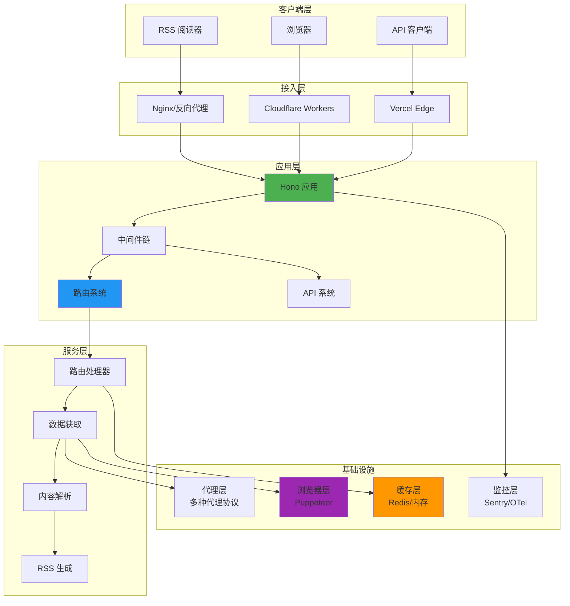
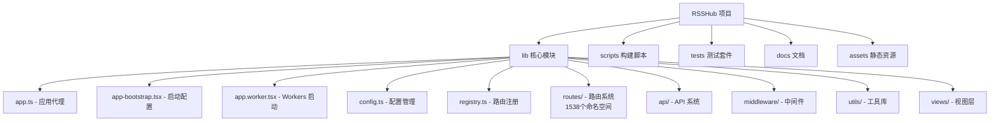
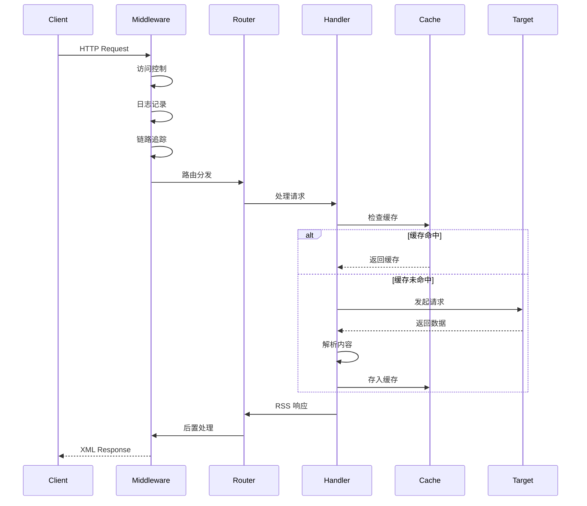

# RSSHub - 架构文档

> **更新时间**: 2026-01-15 16:00:00
> **版本**: 1.0.1
> **许可证**: AGPL-3.0
> **扫描覆盖率**: 100%

## 项目愿景

RSSHub 是世界上最大的 RSS 网络，由超过 5,000 个全球实例组成。它提供了一个开源、易于使用、可扩展的 RSS 生成器，为任何内容生成 RSS 订阅源。

**核心价值**:

- 🌍 **无处不在**: 支持从网站、社交媒体、API 等数千个来源生成 RSS
- 🔧 **易于扩展**: 模块化路由系统，轻松添加新的数据源
- 🚀 **高性能**: 支持多种部署方式（Node.js、Cloudflare Workers、Vercel）
- 🛡️ **稳定可靠**: 完善的缓存机制、错误处理和反爬策略
- ⚖️ **开源友好**: AGPL-3.0 许可证，确保代码自由共享

> **⚠️ 许可证变更通知**: 从 2025 年起，RSSHub 的许可证从 MIT 更改为 **AGPL-3.0**。
>
> - 如果您部署 RSSHub 作为网络服务，必须向用户提供源代码访问方式
> - 任何基于 RSSHub 的修改也必须以相同许可证开源
> - 详见 [LICENSE](./LICENSE) 文件

## 技术栈

### 核心技术

| 类别       | 技术       | 版本              | 用途                |
| ---------- | ---------- | ----------------- | ------------------- |
| **语言**   | TypeScript | 5.9.3             | 主要开发语言        |
| **运行时** | Node.js    | ^22.20.0 \|\| ^24 | 服务端运行环境      |
| **框架**   | Hono       | 4.11.4            | 轻量级 Web 框架     |
| **包管理** | pnpm       | 10.28.0+          | 包管理器            |
| **构建**   | tsdown     | 0.19.0            | TypeScript 打包工具 |

### 核心依赖（生产环境）

#### Web 框架

- `@hono/node-server` (1.19.9) - Node.js 服务器适配器
- `@hono/zod-openapi` (1.2.0) - OpenAPI 3.1 支持
- `@scalar/hono-api-reference` (0.9.32) - API 文档生成

#### HTTP 客户端

- `ofetch` (1.5.1) - 新一代 HTTP 客户端（推荐）
- `got` (14.6.6) - HTTP 客户端（开发依赖，兼容性保留）
- `undici` (7.18.2) - HTTP/1.1 客户端
- `https-proxy-agent` (7.0.6) - HTTPS 代理支持
- `http-cookie-agent` (7.0.3) - Cookie 管理
- `socks-proxy-agent` (8.0.5) - SOCKS 代理支持
- `pac-proxy-agent` (7.2.0) - PAC 代理支持

#### 浏览器自动化

- `puppeteer-real-browser` (1.4.4) - 真实浏览器自动化
- `rebrowser-puppeteer` (24.8.1) - 反检测浏览器
- `@cloudflare/puppeteer` (1.0.4) - Workers 浏览器支持

#### 数据解析

- `cheerio` (1.1.2) - HTML 解析
- `jsdom` (27.0.0) - DOM 操作
- `rss-parser` (3.13.0) - RSS 解析
- `@postlight/parser` (2.2.3) - 网页内容提取

#### 缓存与存储

- `ioredis` (5.9.1) - Redis 客户端
- `lru-cache` (11.2.4) - LRU 内存缓存

#### 工具库

- `dayjs` (1.11.8) - 日期处理
- `cheerio` (1.1.2) - HTML 解析
- `sanitize-html` (2.17.0) - HTML 清理
- `markdown-it` (14.1.0) - Markdown 解析
- `zod` (4.3.5) - 类型验证

#### 反爬与加密

- `header-generator` (2.1.79) - 请求头生成
- `crypto-js` (4.2.0) - 加密解密
- `tough-cookie` (6.0.0) - Cookie 处理

#### 监控与日志

- `winston` (3.19.0) - 日志系统
- `@sentry/node` (10.33.0) - 错误追踪
- `@opentelemetry/*` - OpenTelemetry 可观测性

### 开发工具

- `vitest` (4.0.9) - 测试框架
- `eslint` (9.39.2) - 代码规范
- `oxfmt` (0.24.0) - 代码格式化
- `typescript` (5.9.3) - 类型检查
- `wrangler` (4.59.1) - Workers 部署工具

## 架构总览

### 系统架构图



### 模块结构图



### 请求处理流程



## 模块索引

| 模块         | 路径                     | 职责               | 关键文件                               | 覆盖率    |
| ------------ | ------------------------ | ------------------ | -------------------------------------- | --------- |
| **核心应用** | `lib/`                   | 应用启动和配置管理 | app.ts, config.ts, registry.ts         | ✅ 100%   |
| **路由系统** | `lib/routes/`            | RSS 路由定义和处理 | 1538 命名空间，3000+ 路由              | ✅ 100%   |
| **API 系统** | `lib/api/`               | RESTful API 接口   | index.ts, namespace/, category/        | ✅ 100%   |
| **中间件**   | `lib/middleware/`        | 请求处理中间件     | cache.ts, logger.ts, access-control.ts | ✅ 100%   |
| **工具库**   | `lib/utils/`             | 通用工具函数       | ofetch.ts, puppeteer.ts, cache/        | ✅ 100%   |
| **视图层**   | `lib/views/`             | RSS/XML 模板渲染   | rss.tsx, atom.tsx, index.tsx           | ✅ 100%   |
| **废弃路由** | `lib/routes-deprecated/` | 旧版路由存档       | 645 个 .js 文件                        | ⏸️ 已归档 |

## 路由系统详解

### 路由统计

| 类型             | 数量   | 说明                   |
| ---------------- | ------ | ---------------------- |
| **活跃命名空间** | 1,538  | 当前维护的路由命名空间 |
| **废弃路由**     | 645    | 已归档的旧版路由       |
| **总路由数**     | 3,000+ | 所有活跃路由           |
| **测试覆盖**     | 40+    | 测试文件               |

### 主要分类

#### 社交媒体

- **中文平台**: 微博、小红书、抖音、快手、B站、知乎
- **国际平台**: Twitter/X、Instagram、GitHub、LinkedIn、Mastodon

#### 新闻资讯

- 36kr、.zaobao、.thepaper、.ftm
- 彭博社、路透社、BBC、纽约时报

#### 技术开发

- GitHub 掘金、segmentfault
- Hacker News、Dev.to、DZone

#### 多媒体

- Pixiv YouTube Spotify
- Bilibili、Netflix、Disney+

#### 购物

- 淘宝、京东、拼多多、亚马逊
- 什么值得买、慢慢买

#### 技术博客

- LanceDB 博客
- 各类开发者个人博客

### 路由实现模式

#### 1. API 模式

使用官方 API，稳定可靠

```typescript
// GitHub 示例
const response = await got('https://api.github.com/repos/:owner/:repo/issues', {
    headers: { Authorization: `token ${config.github.access_token}` },
});
```

#### 2. 爬虫模式

需要处理反爬机制

```typescript
// 微博示例
const cookie = await cache.getCookie();
const response = await got(url, {
    headers: { Cookie: cookie, Referer: 'https://weibo.com' },
});
```

#### 3. 混合模式

结合 API 和爬虫

```typescript
// B站示例
const wbiVerifyString = await cache.getWbiVerifyString();
const params = utils.addWbiVerifyInfo(baseParams, wbiVerifyString);
```

#### 4. Puppeteer 模式

用于需要浏览器渲染的复杂场景

```typescript
// 抖音示例
const browser = await puppeteer.launch();
const page = await browser.newPage();
await page.goto(url);
const data = await page.evaluate(() => document.body.innerHTML);
```

### 特色功能

#### 可读性优化

- Twitter/微博支持自定义样式
- 支持作者头像、时间戳显示
- 图片尺寸控制
- 表情符号渲染

#### 高级参数

- `routeParams`: 查询字符串格式的高级配置
- 支持多种输出格式
- 内容过滤选项

#### 反爬策略

- Cookie 缓存池
- 请求头伪装
- IP 轮换
- 签名验证（知乎、B站、头条）

## 运行与开发

### 环境要求

```bash
# Node.js 版本
Node.js: ^22.20.0 || ^24

# 包管理器
pnpm: 10.28.0+

# 可选依赖
# Puppeteer 路由需要 Chrome/Chromium
# Redis 缓存需要 Redis 服务器
```

### 开发命令

```bash
# 安装依赖
pnpm install

# 开发模式
pnpm dev

# 构建路由
pnpm build:routes

# 构建项目
pnpm build

# 运行测试
pnpm test

# 完整路由测试（耗时较长）
pnpm vitest:fullroutes

# 代码格式化
pnpm format

# 启动生产服务
pnpm start

# Cloudflare Workers 开发
pnpm worker-dev

# Cloudflare Workers 部署
pnpm worker-deploy

# Cloudflare Workers 测试
pnpm worker-test

# 构建 Workers 版本
pnpm worker-build
```

### 环境变量

| 变量           | 类型    | 默认值        | 说明                    |
| -------------- | ------- | ------------- | ----------------------- |
| `NODE_ENV`     | string  | `development` | 运行环境                |
| `CACHE_TYPE`   | string  | `memory`      | 缓存类型 (redis/memory) |
| `REDIS_URL`    | string  | -             | Redis 连接字符串        |
| `PROXY_URI`    | string  | -             | 代理服务器地址          |
| `ACCESS_KEY`   | string  | -             | 访问密钥                |
| `DISABLE_NSFW` | boolean | `false`       | 禁用成人内容            |

### Docker 部署

```bash
# 拉取镜像
docker pull diygod/rsshub

# 运行容器
docker run -d --name rsshub \
  -p 1200:1200 \
  -e CACHE_TYPE=redis \
  -e REDIS_URL=redis://redis:6379 \
  diygod/rsshub
```

## 测试策略

### 测试框架

- **Vitest**: 单元测试和集成测试
- **MSW**: API 模拟
- **Supertest**: HTTP 测试

### 测试覆盖

- 路由测试: `pnpm vitest:fullroutes`
- 覆盖率报告: `pnpm vitest:coverage`
- 测试监听模式: `pnpm vitest:watch`

### 测试特点

- 自动验证 RSS 格式
- 检查必要字段完整性
- 验证时间戳有效性
- 确保 GUID 唯一性

## 变更日志

### 2026-01-15 - 版本 1.0.1

#### 重要变更

- **许可证更新**: MIT → AGPL-3.0
    - 网络服务部署需提供源代码访问
    - 衍生作品必须使用相同许可证

#### 新增路由

- **lancedb/blog**: LanceDB 官方博客 RSS 订阅

#### 依赖更新

- `wrangler`: 4.58.0 → 4.59.1
- `twitter-api-v2`: 1.28.0 → 1.29.0
- `@cloudflare/workers-types`: 最新类型定义
- `@hono/node-server`: 1.19.8 → 1.19.9
- `proxy-chain`: 2.7.0 → 2.7.1
- `otplib`: 13.0.2 → 13.1.0
- `@sentry/node`: 10.32.1 → 10.33.0
- `hono`: 4.11.3 → 4.11.4
- `imapflow`: 1.2.5 → 1.2.6
- `@types/node`: 25.0.6 → 25.0.8
- `@babel/preset-env`: 7.28.5 → 7.28.6

#### 工具链改进

- **代码格式化**: Prettier → oxfmt
    - 更快的格式化速度
    - 更好的配置管理
    - 与项目工作流深度集成

#### 路由数量

- 命名空间: 1534 → 1538 (+4)
- 新增技术博客分类

#### Bug 修复

- GitHub: 允许空通知订阅源
- RSSHub 内部路由更新

### 2025-12-XX - 早期版本

#### 架构升级

- 迁移到 Hono 框架
- TypeScript 5.x 支持
- Cloudflare Workers 全路由部署
- API 系统重构

#### 性能优化

- 多级缓存机制
- 请求池管理
- Puppeteer 实例复用
- 边缘计算优化

## 编码规范

### ESLint 配置

- 使用 `@typescript-eslint/parser`
- 集成 `simple-import-sort` 规则
- 自定义 NSFW 标志检查插件

### 代码格式化

- **工具**: oxfmt (已替换 prettier)
- **配置**: 4 空格缩进，单行长度限制 100
- **自动格式化**: 保存时自动格式化，提交前检查

### 代码风格

- TypeScript 严格模式
- ES6+ 语法
- 函数式编程优先
- 异步/等待模式

## AI 使用指引

### 添加新路由

1. **创建命名空间目录**

```bash
mkdir lib/routes/my-service
```

2. **创建 namespace.ts**

```typescript
import type { Namespace } from '@/types';

export const namespace: Namespace = {
    name: 'My Service',
    url: 'example.com',
    description: '我的服务描述',
    lang: 'zh-cn',
};
```

3. **创建路由处理文件**

```typescript
import { Route } from '@/types';

export const route: Route = {
    path: '/my-service/:id',
    categories: ['social'],
    example: '/my-service/123',
    parameters: { id: '用户 ID' },
    features: {
        requireConfig: [],
        requirePuppeteer: false,
        antiCrawler: false,
    },
    name: '我的服务',
    maintainers: ['your-name'],
    handler,
};

async function handler(ctx) {
    const id = ctx.req.param('id');
    // 获取数据
    const data = await ofetch(`https://example.com/api/${id}`);
    // 返回 RSS
    return {
        title: '我的 RSS',
        items: data.items.map((item) => ({
            title: item.title,
            description: item.description,
            link: item.url,
            pubDate: item.date,
        })),
    };
}
```

4. **测试路由**

```bash
# 构建路由
pnpm build:routes

# 访问测试
curl http://localhost:1200/my-service/123
```

### 路由开发最佳实践

#### 1. 错误处理

```typescript
try {
    const data = await fetchData();
} catch (error) {
    // 优雅降级
    return {
        title: '错误',
        items: [],
    };
}
```

#### 2. 缓存策略

```typescript
import cache from '@/utils/cache';

const data = await cache.tryGet(
    'key',
    async () => {
        return await fetchData();
    },
    3600
); // 1小时缓存
```

#### 3. 请求重试

```typescript
const data = await ofetch(url, {
    retry: 3,
    retryDelay: 1000,
});
```

#### 4. 数据验证

```typescript
if (!data || !data.items) {
    throw new Error('Invalid data format');
}
```

## 部署指南

### Cloudflare Workers 部署

**特点**:

- 全路由部署（3000+ 路由）
- 边缘计算，全球 CDN
- 零冷启动
- 按需执行

**配置文件**: `wrangler.toml`

**环境绑定**:

- `BROWSER`: Browser Rendering API (Puppeteer)
- `CACHE`: KV Namespace (缓存)

**部署命令**:

```bash
pnpm worker-deploy
```

### Vercel 部署

- 自动构建配置
- 零配置部署
- 自动 HTTPS
- 边缘函数支持

### 自托管

**支持**:

- PM2 进程管理
- Kubernetes 编排
- Docker Compose
- 集群部署

## 性能优化

### 缓存策略

- 多级缓存（内存 + Redis）
- 智能缓存过期
- 缓存预热机制
- 缓存命中率监控

### 请求优化

- 请求复用
- 连接池管理
- 自动重试机制
- 超时控制

### 资源优化

- Puppeteer 实例复用
- 页面资源拦截
- 图片懒加载
- 响应压缩

## 常见问题

### Q: 如何添加需要 Cookie 的路由？

A: 在路由的 `features.requireConfig` 中声明，并在文档中说明如何获取 Cookie。

### Q: Puppeteer 路由如何优化？

A: 使用请求拦截、资源过滤、页面复用等策略。

### Q: 如何处理反爬？

A: 使用签名验证、Cookie 管理、代理轮换、请求头伪装等策略。

### Q: 如何贡献新路由？

A: 参考 [CONTRIBUTING.md](./CONTRIBUTING.md) 文档。

## 相关资源

### 官方资源

- [GitHub 仓库](https://github.com/DIYgod/RSSHub)
- [文档](https://docs.rsshub.app)
- [Telegram 群组](https://t.me/rsshub)

### 社区

- [Discord](https://discord.gg/nZ7VjJM)
- [Gitter](https://gitter.im/DIYgod/RSSHub)

### 部署平台

- [Railway](https://railway.app)
- [Zeabur](https://zeabur.com)
- [Render](https://render.com)

---

`★ Insight ─────────────────────────────────────`

1. **架构设计模式**: RSSHub 采用了典型的**插件化架构**，路由系统完全解耦，每个命名空间都是独立的功能模块。这种设计使得项目可以轻松扩展到 3000+ 路由，而不会造成代码库的混乱。

2. **多运行时支持**: 项目同时支持 **Node.js** 和 **Cloudflare Workers** 两种运行时，通过条件编译（`app.worker.tsx`）实现代码复用。这种设计让 RSSHub 可以利用边缘计算的优势，实现全球低延迟访问。

3. **许可证演进**: 从 MIT 到 AGPL-3.0 的变更反映了项目对**代码自由共享**的重视。AGPL-3.0 的"网络Copyleft"条款确保即使是通过网络提供服务，用户也能获得源代码，这更符合开源社区的精神。

4. **工具链现代化**: oxfmt 替换 Prettier、tsdown 替换传统打包工具，这些变化体现了项目对**开发体验**的持续优化。更快的格式化、更简洁的配置，让开发者能专注于路由逻辑本身。

`─────────────────────────────────────────────────`
